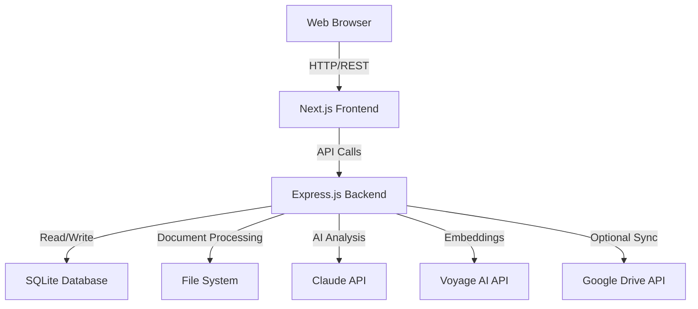
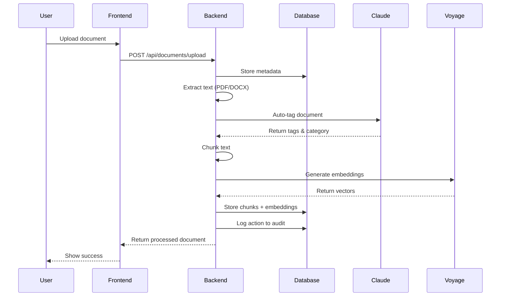

# System Architecture

This document describes the high-level architecture of ComplianceA.

## Architecture Overview

ComplianceA follows a three-tier architecture:

## Component Layers

### 1. Frontend Layer (Next.js)

**Technology:** Next.js 15 with React 19, Server-Side Rendering

**Components:**
- **Pages:** Documents, Analyze & Ask, Contracts, Settings
- **UI Library:** Radix UI primitives with Shadcn/ui
- **Styling:** Tailwind CSS 4
- **State Management:** React hooks and local component state

**Responsibilities:**
- Render user interface
- Handle user interactions
- Make API calls to backend
- Display results with source citations
- Manage file uploads

### 2. Backend Layer (Express.js)

**Technology:** Express.js with ES modules

**Components:**
- **API Server:** RESTful endpoints for all operations
- **Document Processor:** PDF/DOCX parsing and text extraction
- **Embedding Generator:** Vector embeddings via Voyage AI
- **Search Engine:** Semantic search with cosine similarity
- **Policy Engine:** Rule evaluation for retention and classification
- **Contract Analyzer:** Obligation extraction and lifecycle management

**Responsibilities:**
- Process uploaded documents
- Generate embeddings for semantic search
- Execute AI-powered analysis via Claude
- Manage document metadata and status
- Track obligations and compliance
- Enforce retention policies
- Maintain audit logs

### 3. Data Layer (SQLite)

**Technology:** sql.js (SQLite in-memory with file persistence)

**Tables:**
- documents - Document library
- chunks - Text embeddings
- contract_obligations - Extracted obligations
- tasks - Action items
- qa_cards - Reusable answers
- audit_log - Action history
- policy_rules - Classification rules
- legal_holds - Legal hold management
- app_settings - Configuration storage

**Responsibilities:**
- Store document metadata
- Persist embeddings for search
- Track obligations and tasks
- Record audit trail
- Maintain system configuration

### 4. External Services

**Anthropic Claude:**
- Document analysis and metadata extraction
- Natural language Q&A generation
- Contract obligation extraction
- Questionnaire answer generation
- Model: `claude-sonnet-4-20250514` (configurable)

**Voyage AI:**
- Text embedding generation
- Model: `voyage-3-lite` (1024 dimensions)
- Used for semantic search

**Google Drive (Optional):**
- Document sync from shared folders
- Service account authentication
- Periodic polling for changes

## Data Flow Architecture

## Deployment Architecture

**Hosting:** Railway (configured via railway.toml)

**Components:**
- Node.js runtime
- Express server on port 3000 (configurable)
- SQLite database file persistence
- Local file storage for documents

**Environment Variables:**
- `ANTHROPIC_API_KEY` - Claude API key
- `VOYAGE_API_KEY` - Voyage embeddings API key
- `PORT` - Server port (default: 3000)
- `CLAUDE_MODEL` - Claude model name (default: claude-sonnet-4-20250514)
- `EMBEDDING_MODEL` - Voyage model (default: voyage-3-lite)

## Security Considerations

**Authentication:**
- No user authentication in current implementation
- API keys stored in environment variables

**Data Storage:**
- Documents stored on local filesystem
- Database credentials encrypted in app_settings table
- API keys never exposed to frontend

**File Handling:**
- File uploads validated by type (PDF/DOCX only)
- Malware scanning not implemented (add if needed)

## Scalability Notes

**Current Design:**
- Single-server architecture
- In-memory database with file persistence
- File storage on local disk

**Scaling Considerations:**
- Move to PostgreSQL for multi-instance support
- Add cloud storage (S3) for documents
- Implement caching layer (Redis)
- Add load balancer for multiple backend instances
- Consider vector database (Pinecone, Weaviate) for embeddings
