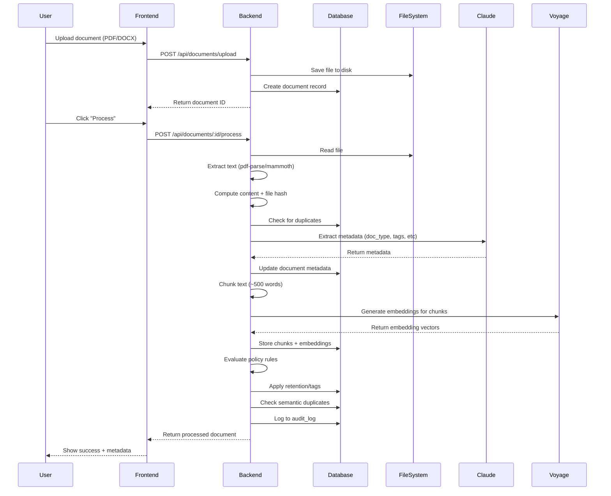
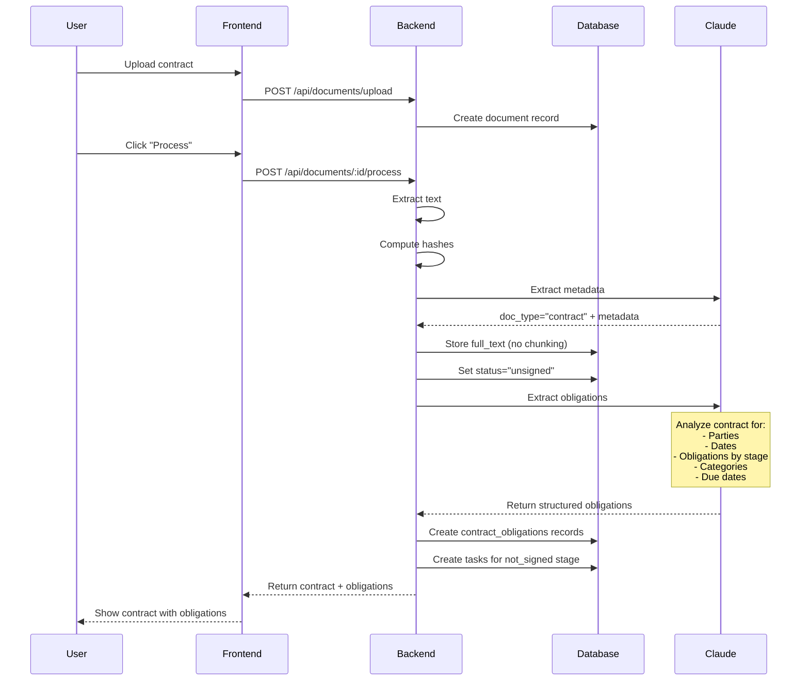
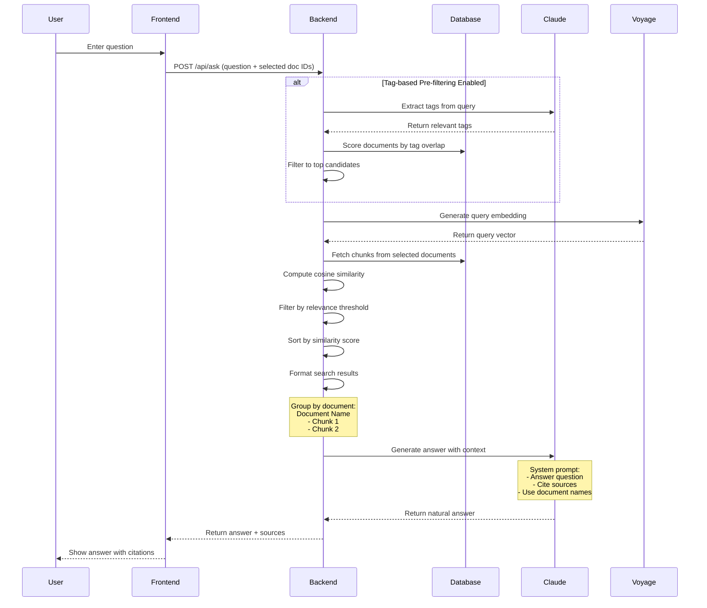
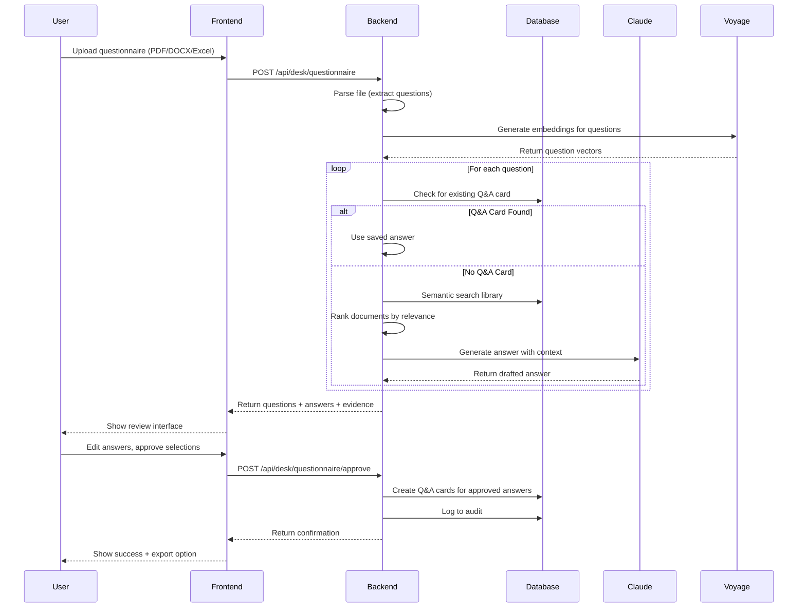
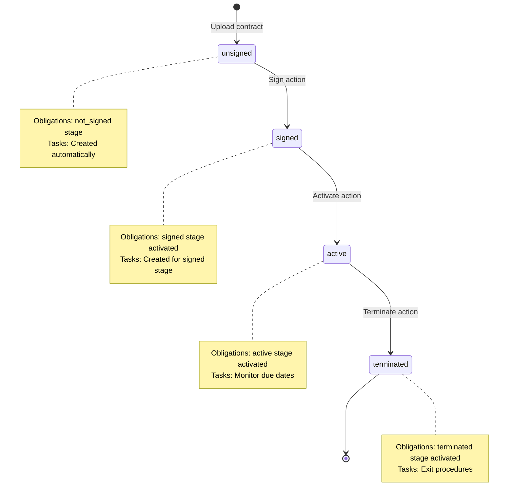
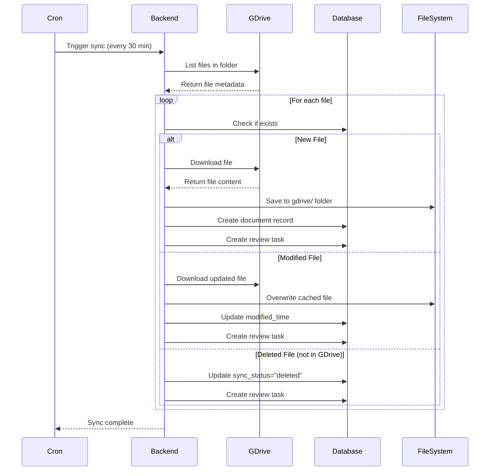

# Data Flow Documentation

This document describes how data moves through the ComplianceA system for key operations.

## Document Processing Flow

### Standard Document Processing



**Key Steps:**
1. **Upload** - File saved to disk, metadata record created
2. **Extract** - Text extraction via pdf-parse (PDF) or mammoth (DOCX)
3. **Hash** - Compute content hash (text) and file hash (binary)
4. **Duplicate Detection** - Check for exact matches
5. **Auto-tag** - Claude extracts doc_type, jurisdiction, client, sensitivity
6. **Chunk** - Split text into ~500-word chunks with 50-word overlap
7. **Embed** - Generate 1024-dim vectors via Voyage AI
8. **Store** - Save chunks and embeddings to database
9. **Policy** - Evaluate and apply retention/classification rules
10. **Semantic Duplicates** - Compare embeddings (threshold: 0.92)
11. **Audit** - Log action to audit_log

### Contract Processing Flow



**Key Differences from Standard:**
- **No chunking** - Full text stored in `full_text` column
- **No embeddings** - Contracts aren't searchable semantically (use full-text search instead)
- **Obligation extraction** - Claude extracts structured obligation data
- **Lifecycle** - Status starts as "unsigned"
- **Auto-tasks** - Tasks created for not_signed stage obligations

## Semantic Search Flow

### Ask the Library



**Key Features:**
- **Two-stage filtering** - Tag-based pre-filter + semantic search
- **Cosine similarity** - Compare query vector with chunk vectors
- **Relevance threshold** - Configurable minimum similarity (default: 0.7)
- **Source attribution** - Results include document name + relevance %

## Questionnaire Processing Flow



**Key Steps:**
1. **Parse** - Extract questions from file
2. **Embed** - Generate vectors for all questions
3. **Match** - Check for existing Q&A cards (semantic match)
4. **Search** - For new questions, search library documents
5. **Generate** - Claude drafts answers with evidence
6. **Review** - User edits and approves answers
7. **Save** - Create Q&A cards for reuse
8. **Export** - CSV with questions, answers, sources

## Contract Lifecycle Flow



**State Transitions:**

**Sign Contract (unsigned → signed):**
1. Update document status to "signed"
2. Activate obligations in "signed" stage
3. Deactivate obligations in "not_signed" stage
4. Create tasks for signed-stage obligations

**Activate Contract (signed → active):**
1. Update document status to "active"
2. Activate obligations in "active" stage
3. Deactivate obligations in "signed" stage
4. Create tasks for active-stage obligations

**Terminate Contract (active → terminated):**
1. Update document status to "terminated"
2. Activate obligations in "terminated" stage
3. Deactivate obligations in "active" stage
4. Create tasks for termination obligations

## Google Drive Sync Flow



**Key Features:**
- **Periodic polling** - Runs every N minutes (configurable)
- **Change detection** - Compare modified times
- **Local cache** - Files stored in gdrive/ folder
- **Task creation** - Review tasks for changes
- **Deletion tracking** - Mark as deleted, don't auto-remove

## Data Export Flows

### Translation Export (DOCX)

```
User uploads document → Process → Claude translates → Format as DOCX → Download
```

### Todo Export (CSV)

```
User uploads document → Process → Claude extracts todos by department → Format as CSV → Download
```

### Questionnaire Export (CSV)

```
User uploads questionnaire → Process → Generate answers → User approves → Format as CSV → Download
Columns: Question Number, Question, Answer, Confidence, Sources
```

## Error Handling Patterns

**File Processing Errors:**
- PDF parsing failure → Return error, log to audit
- DOCX parsing failure → Return error, log to audit
- File not found → Return 404

**API Errors:**
- Claude API error → Retry with exponential backoff, log error
- Voyage API error → Retry, log error
- Rate limiting → Queue request, retry later

**Database Errors:**
- Write failure → Rollback transaction, return error
- Duplicate key → Return conflict error

**All errors logged to audit_log for compliance tracking.**
