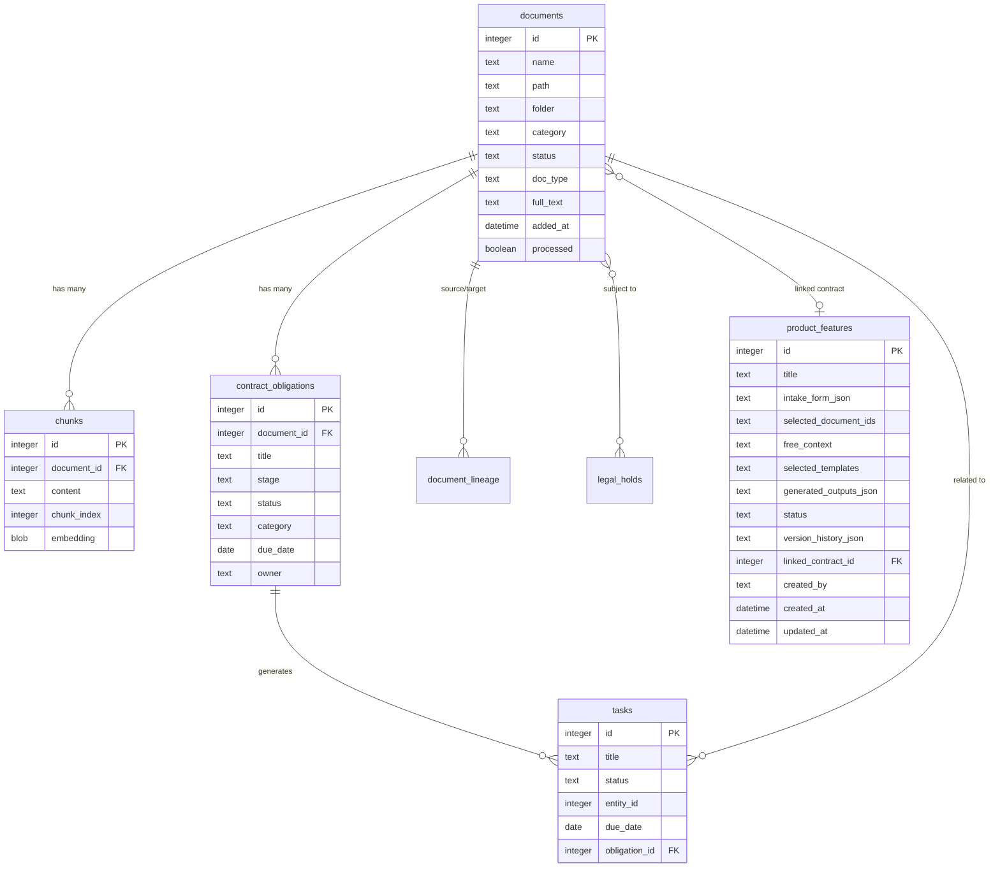

# Database Schema

This document describes the SQLite database structure used by ComplianceA.

## Entity Relationship Diagram

## Tables

### documents

Primary table for document library storage.

**Columns:**

| Column | Type | Description |
|--------|------|-------------|
| id | INTEGER PRIMARY KEY | Unique document identifier |
| name | TEXT | Display name |
| path | TEXT UNIQUE | File path on disk |
| folder | TEXT | Parent folder path |
| category | TEXT | Department category |
| status | TEXT | Document status (draft, in_review, approved, archived, disposed) |
| doc_type | TEXT | Document type (contract, policy, procedure, report, etc) |
| added_at | DATETIME | Upload timestamp |
| processed | BOOLEAN | Processing completion flag |
| page_count | INTEGER | Number of pages |
| word_count | INTEGER | Word count |
| content_hash | TEXT | SHA-256 of text content (duplicate detection) |
| file_hash | TEXT | SHA-256 of file binary (exact duplicate detection) |
| full_text | TEXT | Complete text (contracts only, non-chunked) |
| tags | TEXT | Comma-separated tags |
| auto_tags | TEXT | AI-generated tags |
| confirmed_tags | TEXT | User-confirmed tags |
| client | TEXT | Client name |
| jurisdiction | TEXT | Legal jurisdiction |
| sensitivity | TEXT | Data sensitivity level |
| language | TEXT | Document language |
| in_force | BOOLEAN | Currently in force flag |
| version | INTEGER | Version number |
| canonical_id | INTEGER | Reference to canonical version |
| superseded_by | INTEGER | Reference to newer version |
| retention_label | TEXT | Retention policy label |
| retention_until | DATE | Retention expiration date |
| legal_hold | BOOLEAN | Legal hold flag |
| gdrive_file_id | TEXT | Google Drive file ID |
| gdrive_modified_time | DATETIME | Last modified time in Drive |
| sync_status | TEXT | Sync status (synced, deleted, error) |
| contracting_company | TEXT | Company party to contract |
| contracting_vendor | TEXT | Vendor party to contract |
| signature_date | DATE | Contract signature date |
| commencement_date | DATE | Contract start date |
| expiry_date | DATE | Contract end date |

**Indexes:**
- PRIMARY KEY (id)
- UNIQUE (path)
- INDEX (category)
- INDEX (status)
- INDEX (doc_type)
- INDEX (content_hash)
- INDEX (file_hash)

---

### chunks

Text chunks with embeddings for semantic search.

**Columns:**

| Column | Type | Description |
|--------|------|-------------|
| id | INTEGER PRIMARY KEY | Unique chunk identifier |
| document_id | INTEGER | Foreign key to documents.id |
| content | TEXT | Chunk text content |
| chunk_index | INTEGER | Position in document (0-based) |
| embedding | BLOB | Float32Array vector (1024 dimensions) |

**Indexes:**
- PRIMARY KEY (id)
- INDEX (document_id)

**Notes:**
- Contracts do NOT have chunks (full_text stored in documents table)
- Chunk size: ~500 words with 50-word overlap
- Embeddings generated via Voyage AI (voyage-3-lite)

---

### contract_obligations

Obligations extracted from contracts.

**Columns:**

| Column | Type | Description |
|--------|------|-------------|
| id | INTEGER PRIMARY KEY | Unique obligation identifier |
| document_id | INTEGER | Foreign key to documents.id |
| obligation_type | TEXT | Type of obligation |
| title | TEXT | Obligation title |
| description | TEXT | Full description |
| clause_reference | TEXT | Contract clause reference |
| stage | TEXT | Lifecycle stage (not_signed, signed, active, terminated) |
| status | TEXT | Status (active, inactive, met, waived, finalized) |
| category | TEXT | Category (payments, termination, legal, others) |
| due_date | DATE | Deadline date |
| recurrence | TEXT | Recurrence pattern (one-time, monthly, quarterly, annually) |
| notice_period_days | INTEGER | Notice period in days |
| owner | TEXT | Responsible person |
| escalation_to | TEXT | Escalation contact |
| penalties | TEXT | Penalty description |
| details_json | TEXT | Additional details (JSON) |
| evidence_json | TEXT | Evidence documents (JSON array) |
| finalization_note | TEXT | Completion notes |
| finalization_document_id | INTEGER | Proof document ID |

**Indexes:**
- PRIMARY KEY (id)
- INDEX (document_id)
- INDEX (stage)
- INDEX (status)
- INDEX (due_date)

**Notes:**
- Stage transitions: not_signed → signed → active → terminated
- Only obligations matching contract status are active
- Tasks auto-created for active obligations

---

### tasks

Action items and deadlines.

**Columns:**

| Column | Type | Description |
|--------|------|-------------|
| id | INTEGER PRIMARY KEY | Unique task identifier |
| title | TEXT | Task title |
| description | TEXT | Task description |
| status | TEXT | Status (open, resolved, dismissed) |
| entity_type | TEXT | Related entity type (document, obligation) |
| entity_id | INTEGER | Related entity ID |
| task_type | TEXT | Task category |
| due_date | DATE | Deadline |
| owner | TEXT | Assigned person |
| escalation_to | TEXT | Escalation contact |
| obligation_id | INTEGER | Foreign key to contract_obligations.id |
| created_at | DATETIME | Creation timestamp |

**Indexes:**
- PRIMARY KEY (id)
- INDEX (status)
- INDEX (entity_type, entity_id)
- INDEX (obligation_id)
- INDEX (due_date)

---

### qa_cards

Reusable questionnaire answers.

**Columns:**

| Column | Type | Description |
|--------|------|-------------|
| id | INTEGER PRIMARY KEY | Unique Q&A card identifier |
| question_text | TEXT | Question text |
| approved_answer | TEXT | Approved answer text |
| evidence_json | TEXT | Evidence documents (JSON array) |
| status | TEXT | Status (active, archived) |
| question_embedding | BLOB | Question vector for semantic matching |
| created_at | DATETIME | Creation timestamp |
| updated_at | DATETIME | Last update timestamp |

**Indexes:**
- PRIMARY KEY (id)
- INDEX (status)

**Notes:**
- Used for questionnaire auto-fill
- Semantic matching via question_embedding

---

### audit_log

Complete action history for compliance.

**Columns:**

| Column | Type | Description |
|--------|------|-------------|
| id | INTEGER PRIMARY KEY | Unique log entry identifier |
| entity_type | TEXT | Entity type (document, obligation, task, etc) |
| entity_id | INTEGER | Entity ID |
| action | TEXT | Action performed |
| details | TEXT | Action details (JSON) |
| created_at | DATETIME | Timestamp |

**Indexes:**
- PRIMARY KEY (id)
- INDEX (entity_type, entity_id)
- INDEX (created_at)

**Notes:**
- Every significant action logged
- Immutable (no updates/deletes)

---

### document_lineage

Version and duplicate tracking.

**Columns:**

| Column | Type | Description |
|--------|------|-------------|
| id | INTEGER PRIMARY KEY | Unique lineage entry identifier |
| source_id | INTEGER | Source document ID |
| target_id | INTEGER | Target document ID |
| relationship | TEXT | Relationship type (duplicate_of, version_of) |
| confidence | REAL | Confidence score (0-1) |
| created_at | DATETIME | Detection timestamp |

**Indexes:**
- PRIMARY KEY (id)
- INDEX (source_id)
- INDEX (target_id)

**Notes:**
- Tracks exact duplicates (file_hash match)
- Tracks near-duplicates (embedding similarity > 0.92)
- Tracks versions (manual relationships)

---

### policy_rules

Document classification and retention policies.

**Columns:**

| Column | Type | Description |
|--------|------|-------------|
| id | INTEGER PRIMARY KEY | Unique policy identifier |
| name | TEXT | Policy name |
| condition_json | TEXT | Match conditions (JSON) |
| action_type | TEXT | Action to take (set_retention, require_approval, add_tag, flag_review) |
| action_params | TEXT | Action parameters (JSON) |
| enabled | BOOLEAN | Enabled flag |
| created_at | DATETIME | Creation timestamp |

**Indexes:**
- PRIMARY KEY (id)
- INDEX (enabled)

**Notes:**
- Evaluated after document processing
- Conditions match on doc_type, jurisdiction, tags, client, etc

---

### legal_holds

Legal hold management.

**Columns:**

| Column | Type | Description |
|--------|------|-------------|
| id | INTEGER PRIMARY KEY | Unique hold identifier |
| matter_name | TEXT | Matter/case name |
| scope_json | TEXT | Document scope criteria (JSON) |
| status | TEXT | Status (active, released) |
| created_at | DATETIME | Hold placement date |
| released_at | DATETIME | Release date |
| notes | TEXT | Additional notes |

**Indexes:**
- PRIMARY KEY (id)
- INDEX (status)

**Notes:**
- Documents under hold cannot be deleted/disposed
- Overrides retention policies

---

### app_settings

Key-value configuration storage.

**Columns:**

| Column | Type | Description |
|--------|------|-------------|
| key | TEXT PRIMARY KEY | Setting key |
| value | TEXT | Setting value (may be JSON) |
| updated_at | DATETIME | Last update timestamp |

**Indexes:**
- PRIMARY KEY (key)

**Notes:**
- Stores: API keys, GDrive credentials, feature flags, configuration
- Sensitive values should be encrypted

---

## Relationships

**documents → chunks**
- One document has many chunks (unless it's a contract)
- CASCADE DELETE (delete chunks when document deleted)

**documents → contract_obligations**
- One contract has many obligations
- CASCADE DELETE (delete obligations when contract deleted)

**contract_obligations → tasks**
- One obligation can generate multiple tasks
- Tasks reference obligation_id
- Tasks remain if obligation deleted (audit trail)

**documents → tasks**
- Documents can have associated tasks (review, approval, etc)
- Tasks reference entity_type="document" + entity_id

**documents → document_lineage**
- Many-to-many relationship tracking versions and duplicates
- source_id and target_id both reference documents.id

**documents ↔ legal_holds**
- Many-to-many relationship (implicit via scope_json)
- Legal holds define scope criteria (doc_type, tags, date range)
- Documents flagged via legal_hold boolean

---

### product_features

Stores Product Hub features created by users — each feature goes through a 4-step wizard (intake form → document context → template selection → AI generation).

**Columns:**

| Column | Type | Description |
|--------|------|-------------|
| id | INTEGER PRIMARY KEY | Auto-incremented feature identifier |
| title | TEXT NOT NULL | Feature display name (default: 'Untitled Feature') |
| intake_form_json | TEXT | JSON-serialised `IntakeForm` object (sections A/B/C) |
| selected_document_ids | TEXT | JSON array of document IDs selected as context |
| free_context | TEXT | Free-form context pasted by the user (emails, notes, etc.) |
| selected_templates | TEXT | JSON array of `TemplateId` values (prd, tech_spec, feature_brief, business_case) |
| generated_outputs_json | TEXT | JSON map of `TemplateId → { sections: Record<string,string>, gaps: string[] }` |
| status | TEXT | Feature lifecycle status: idea, in_spec, in_review, approved, in_development, shipped (default: 'idea') |
| version_history_json | TEXT | JSON array of `VersionSnapshot` objects (timestamp, trigger, templates, snapshot) — capped at 20 entries |
| linked_contract_id | INTEGER | FK → documents.id for contract traceability (nullable) |
| created_by | TEXT | Creator identifier (nullable) |
| created_at | DATETIME | Creation timestamp (auto) |
| updated_at | DATETIME | Last-modified timestamp (auto) |

**Indexes:**
- `idx_product_features_status` on `status`
- `idx_product_features_created` on `created_at`

**Relationships:**
- `linked_contract_id` references `documents.id` (optional contract traceability link)
- `selected_document_ids` references `documents.id` values (stored as JSON, not a FK)

---

## Data Types

**TEXT** - Variable-length strings (UTF-8)
**INTEGER** - Signed integers (up to 8 bytes)
**REAL** - Floating point numbers
**BLOB** - Binary data (embeddings stored as Float32Array buffers)
**BOOLEAN** - Stored as INTEGER (0 = false, 1 = true)
**DATE** - Stored as TEXT (ISO 8601 format: YYYY-MM-DD)
**DATETIME** - Stored as TEXT (ISO 8601 format: YYYY-MM-DD HH:MM:SS)

---

## Storage Size Estimates

**documents**: ~2-5 KB per record (varies with full_text)
**chunks**: ~1.5 KB per chunk (500 words + 4 KB embedding)
**contract_obligations**: ~1 KB per obligation
**tasks**: ~500 bytes per task
**qa_cards**: ~2 KB per card
**audit_log**: ~500 bytes per entry
**product_features**: ~5-50 KB per record (varies with generated_outputs_json and version_history_json)

**Typical database size**: 50-100 MB for 1000 documents with embeddings
