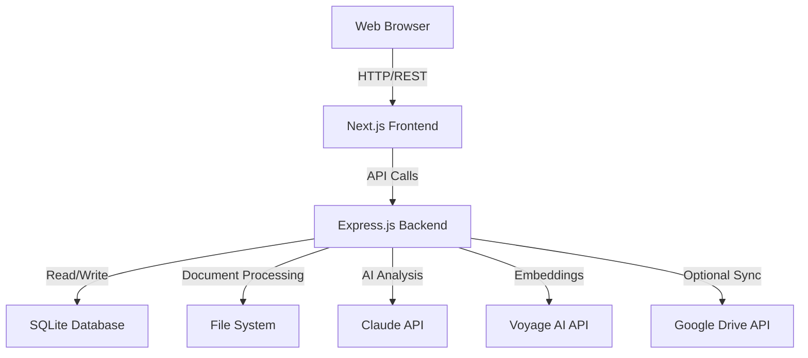
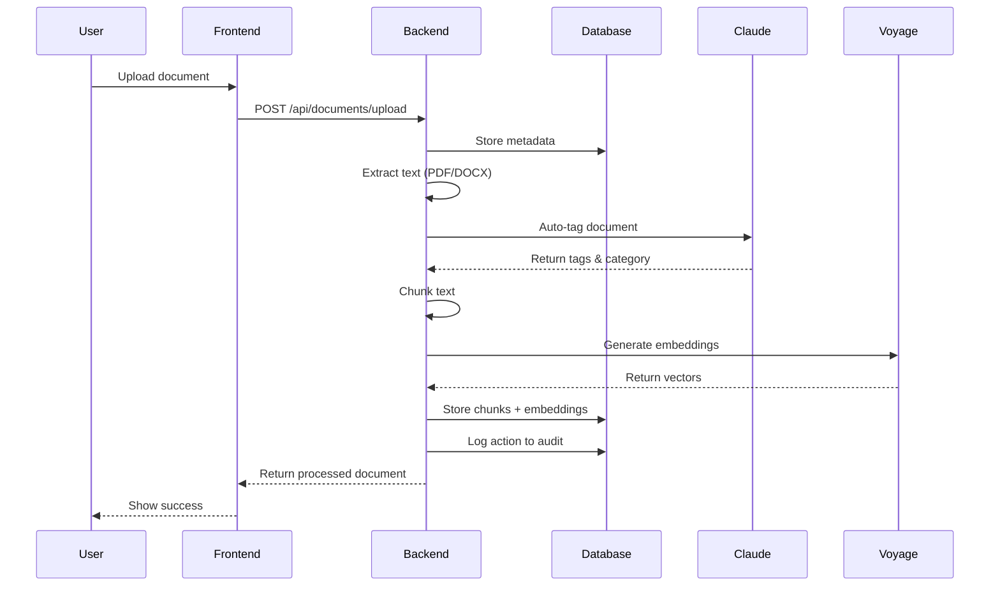
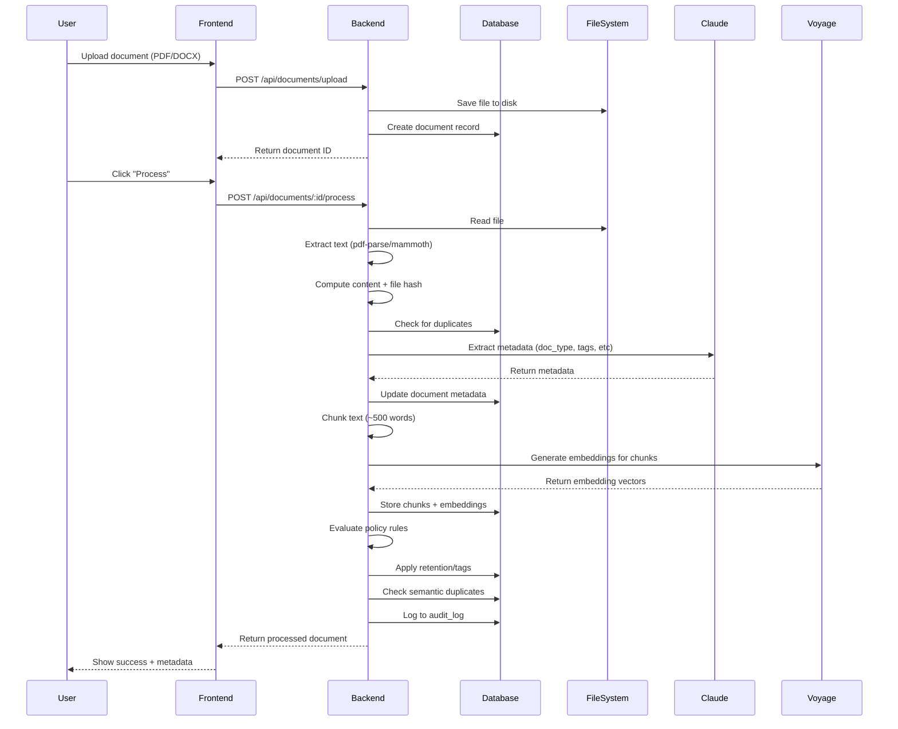
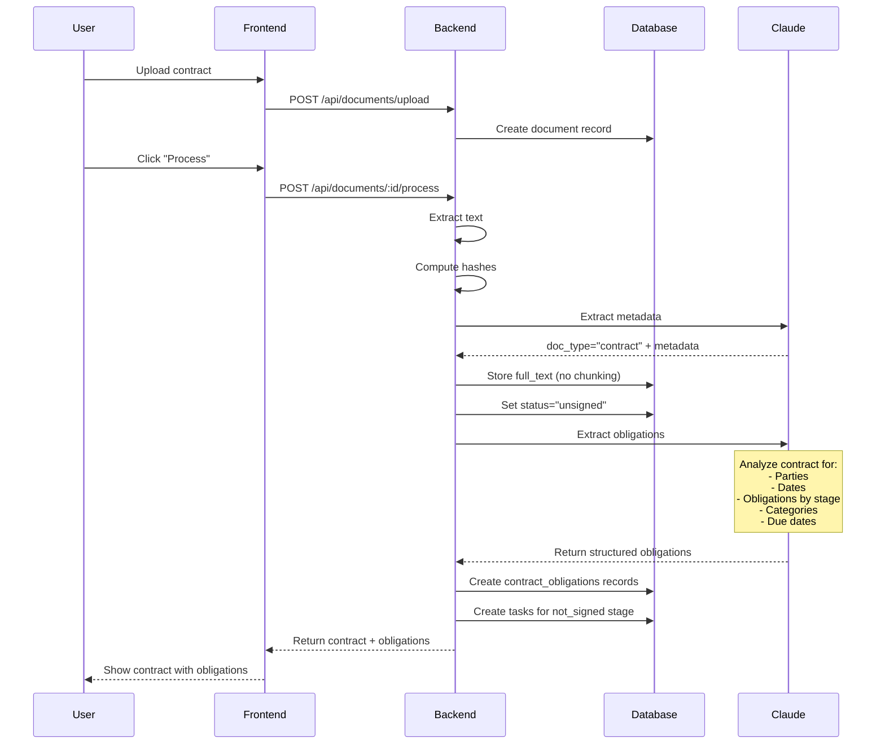
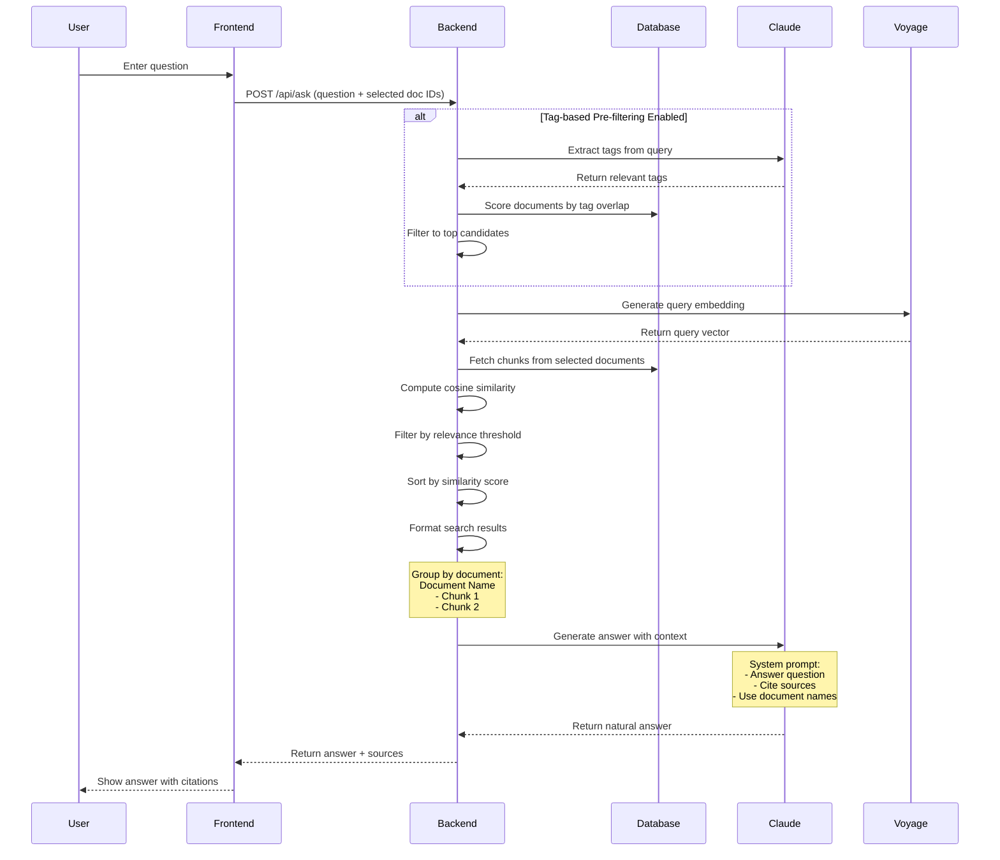
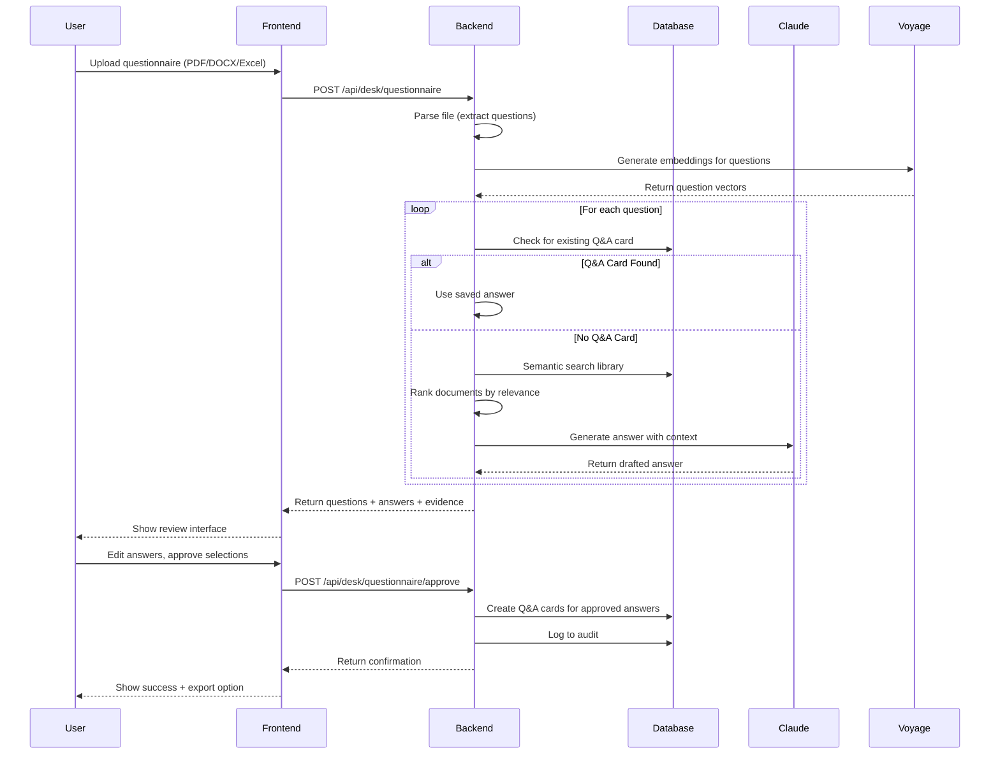
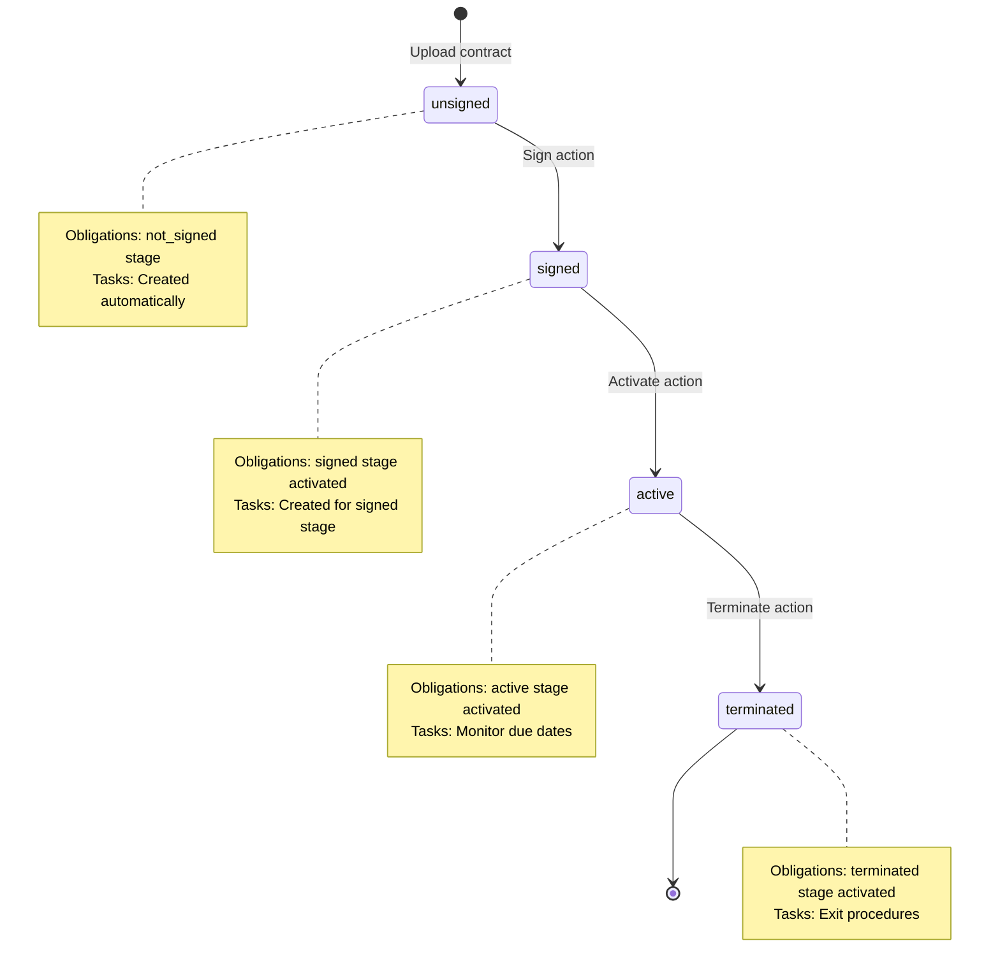
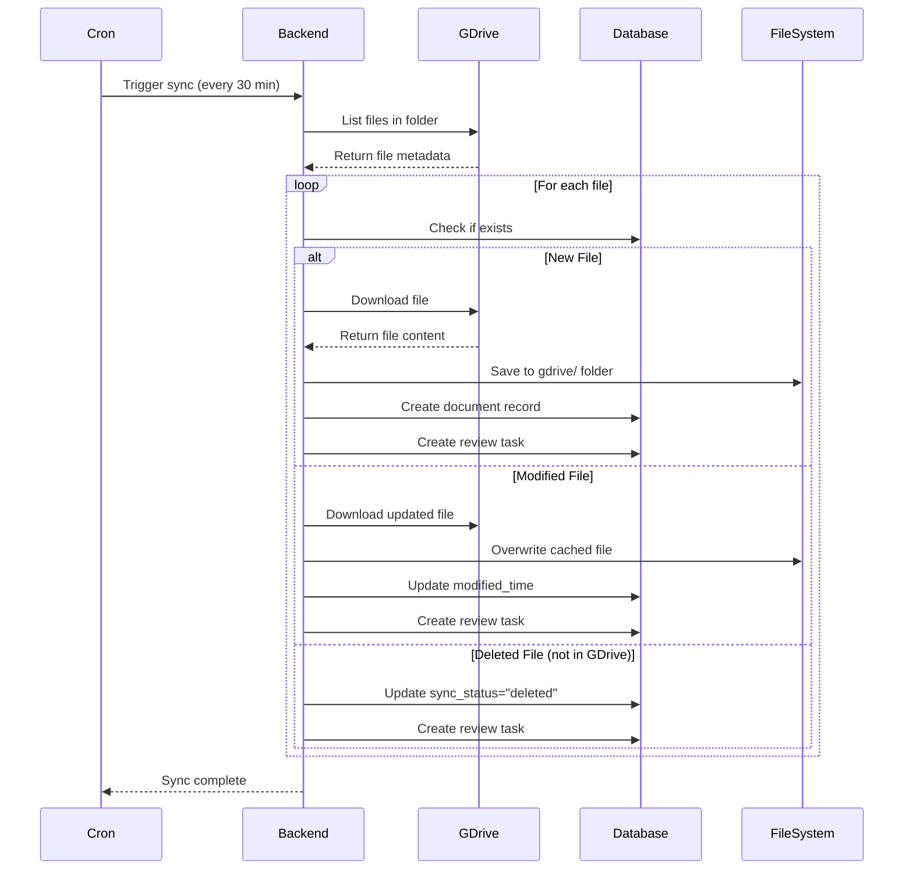
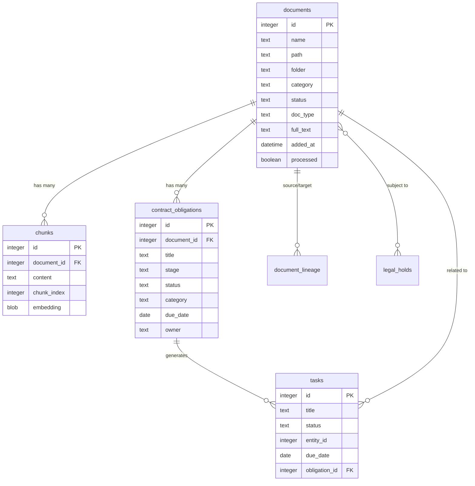

# Project Documentation Implementation Plan

> **For Claude:** REQUIRED SUB-SKILL: Use superpowers:executing-plans to implement this plan task-by-task.

**Goal:** Create comprehensive developer documentation for the ComplianceA document analyzer application

**Architecture:** Seven focused markdown documents covering system overview, architecture, features, tech stack, data flows, database schema, and API endpoints. Documentation will be analyzed from existing codebase and include Mermaid diagrams for visual clarity.

**Tech Stack:** Markdown, Mermaid diagrams

---

## Task 1: Create overview.md

**Files:**
- Create: `docs/overview.md`

**Step 1: Create overview document**

```markdown
# ComplianceA - Document Analyzer Overview

> Project documentation for developers and maintainers

## What is ComplianceA?

ComplianceA is an AI-powered compliance document management and analysis platform. It helps organizations manage contracts, extract obligations, answer regulatory questionnaires, and maintain audit trails for compliance purposes.

## Key Capabilities

- **Document Library Management** - Upload, categorize, and search PDF/DOCX documents
- **Semantic Search** - Ask natural language questions across document library
- **Contract Management** - Extract and track contractual obligations with lifecycle management
- **Questionnaire Processing** - Auto-generate answers to regulatory questionnaires from library documents
- **Obligation Tracking** - Monitor due dates, owners, evidence, and compliance status
- **Google Drive Integration** - Sync documents from Google Drive folders
- **Audit Trail** - Complete action history for compliance traceability

## Quick Links

- [Architecture](./architecture.md) - System design and component overview
- [Features](./features.md) - Detailed feature descriptions and workflows
- [Tech Stack](./tech-stack.md) - Technologies and libraries used
- [Data Flow](./data-flow.md) - How data moves through the system
- [Database Schema](./database-schema.md) - Database tables and relationships
- [API Endpoints](./api-endpoints.md) - REST API reference

## Getting Started

**Prerequisites:**
- Node.js 18+
- Anthropic API key (Claude)
- Voyage AI API key (embeddings)

**Installation:**
```bash
npm install
cp .env.example .env
# Edit .env with your API keys
```

**Development:**
```bash
npm run dev
# Access at http://localhost:3000
```

**Production:**
```bash
npm run build
npm start
# Or deploy to Railway using railway.toml
```

## Project Structure

```
compliancea/
├── src/
│   ├── app/              # Next.js pages and routes
│   ├── components/       # React UI components
│   ├── lib/              # Database and business logic
│   └── hooks/            # React hooks
├── server.js             # Express backend API
├── public/               # Static assets
├── docs/                 # Documentation (you are here)
└── package.json
```

## Key Integrations

- **Anthropic Claude** - Document analysis, Q&A, obligation extraction
- **Voyage AI** - Text embeddings for semantic search
- **Google Drive** - Document sync (optional)

## Support

For questions or issues, refer to the detailed documentation linked above.
```

**Step 2: Commit**

```bash
git add docs/overview.md
git commit -m "docs: add project overview"
```

---

## Task 2: Create architecture.md

**Files:**
- Create: `docs/architecture.md`

**Step 1: Create architecture document**

```markdown
# System Architecture

This document describes the high-level architecture of ComplianceA.

## Architecture Overview

ComplianceA follows a three-tier architecture:



## Component Layers

### 1. Frontend Layer (Next.js)

**Technology:** Next.js 15 with React 19, Server-Side Rendering

**Components:**
- **Pages:** Documents, Analyze & Ask, Contracts, Settings
- **UI Library:** Radix UI primitives with Shadcn/ui
- **Styling:** Tailwind CSS 4
- **State Management:** React hooks and local component state

**Responsibilities:**
- Render user interface
- Handle user interactions
- Make API calls to backend
- Display results with source citations
- Manage file uploads

### 2. Backend Layer (Express.js)

**Technology:** Express.js with ES modules

**Components:**
- **API Server:** RESTful endpoints for all operations
- **Document Processor:** PDF/DOCX parsing and text extraction
- **Embedding Generator:** Vector embeddings via Voyage AI
- **Search Engine:** Semantic search with cosine similarity
- **Policy Engine:** Rule evaluation for retention and classification
- **Contract Analyzer:** Obligation extraction and lifecycle management

**Responsibilities:**
- Process uploaded documents
- Generate embeddings for semantic search
- Execute AI-powered analysis via Claude
- Manage document metadata and status
- Track obligations and compliance
- Enforce retention policies
- Maintain audit logs

### 3. Data Layer (SQLite)

**Technology:** sql.js (SQLite in-memory with file persistence)

**Tables:**
- documents - Document library
- chunks - Text embeddings
- contract_obligations - Extracted obligations
- tasks - Action items
- qa_cards - Reusable answers
- audit_log - Action history
- policy_rules - Classification rules
- legal_holds - Legal hold management
- app_settings - Configuration storage

**Responsibilities:**
- Store document metadata
- Persist embeddings for search
- Track obligations and tasks
- Record audit trail
- Maintain system configuration

### 4. External Services

**Anthropic Claude:**
- Document analysis and metadata extraction
- Natural language Q&A generation
- Contract obligation extraction
- Questionnaire answer generation
- Model: `claude-sonnet-4-20250514` (configurable)

**Voyage AI:**
- Text embedding generation
- Model: `voyage-3-lite` (1024 dimensions)
- Used for semantic search

**Google Drive (Optional):**
- Document sync from shared folders
- Service account authentication
- Periodic polling for changes

## Data Flow Architecture



## Deployment Architecture

**Hosting:** Railway (configured via railway.toml)

**Components:**
- Node.js runtime
- Express server on port 3000 (configurable)
- SQLite database file persistence
- Local file storage for documents

**Environment Variables:**
- `ANTHROPIC_API_KEY` - Claude API key
- `VOYAGE_API_KEY` - Voyage embeddings API key
- `PORT` - Server port (default: 3000)
- `CLAUDE_MODEL` - Claude model name (default: claude-sonnet-4-20250514)
- `EMBEDDING_MODEL` - Voyage model (default: voyage-3-lite)

## Security Considerations

**Authentication:**
- No user authentication in current implementation
- API keys stored in environment variables

**Data Storage:**
- Documents stored on local filesystem
- Database credentials encrypted in app_settings table
- API keys never exposed to frontend

**File Handling:**
- File uploads validated by type (PDF/DOCX only)
- Malware scanning not implemented (add if needed)

## Scalability Notes

**Current Design:**
- Single-server architecture
- In-memory database with file persistence
- File storage on local disk

**Scaling Considerations:**
- Move to PostgreSQL for multi-instance support
- Add cloud storage (S3) for documents
- Implement caching layer (Redis)
- Add load balancer for multiple backend instances
- Consider vector database (Pinecone, Weaviate) for embeddings
```

**Step 2: Commit**

```bash
git add docs/architecture.md
git commit -m "docs: add system architecture documentation"
```

---

## Task 3: Create features.md

**Files:**
- Create: `docs/features.md`

**Step 1: Create features document**

```markdown
# Features Documentation

This document describes the key features and capabilities of ComplianceA.

## Document Management

### Document Library
- **Upload documents** - PDF and DOCX file support
- **Category assignment** - Organize by department (Finance, Compliance, Operations, HR, Board, IT)
- **Status tracking** - Draft, In Review, Approved, Archived, Disposed
- **Search and filter** - Real-time search by name, filter by status and category
- **Batch operations** - Process all unprocessed, retag all documents
- **Metadata editing** - Update document properties after upload

### Document Processing
- **Text extraction** - Extract text from PDF and DOCX files
- **Auto-tagging** - AI-powered metadata extraction (doc_type, jurisdiction, client, sensitivity)
- **Duplicate detection** - Content hash and file hash matching
- **Semantic analysis** - Near-duplicate detection via embedding similarity
- **Policy evaluation** - Automatic retention and approval requirement assignment

### Document Types
- Contracts (with obligation extraction)
- Policies
- Procedures
- Reports
- Correspondence
- Presentations
- Generic documents

## Analysis & Search

### Document Analyzer
Upload a document and generate:
- **Full Translation** - Translate to 5 languages (English, Polish, German, French, Spanish)
- **Summary** - Concise document summary
- **Key Points** - Extract main points with department tags
- **Department To-Dos** - Generate action items organized by department
- **Export options** - DOCX (translation), CSV (todos)

### Ask the Library
- **Semantic search** - Natural language questions across document library
- **Document selection** - Search entire library or specific documents
- **Source attribution** - Results show document name, relevance score, category
- **Confidence scoring** - Color-coded confidence levels (high/medium/low)
- **Context-aware answers** - AI generates answers citing specific documents

### Cross-Reference Analysis
Two modes for handling external documents:

**Regulator Query Mode:**
- Upload regulator documents
- Cross-reference with library documents
- Generate response templates
- Pre-fill answers with library data
- Output table with questions, answers, sources, confidence

**Questionnaire Mode:**
- Accept PDF, DOCX, or Excel questionnaires
- Paste text or upload file
- Auto-generate answers from library
- Review interface with:
  - Editable answer fields
  - Evidence documents with relevance scores
  - Confidence indicators
  - Bulk approval (all or high-confidence only)
- Export as CSV

## Contract Management

### Contract Processing
- **Automatic detection** - Identifies contract documents during processing
- **Full text storage** - Stores complete contract text (no chunking)
- **Metadata extraction** - Contracting parties, dates (signature, commencement, expiry)
- **Obligation extraction** - AI extracts contractual obligations with details

### Obligation Tracking
- **Lifecycle stages** - not_signed → signed → active → terminated
- **Categories** - Payments, Termination, Legal, Others
- **Due dates** - Track deadlines with recurrence support
- **Ownership** - Assign owners and escalation contacts
- **Evidence management** - Attach proof documents and notes
- **Status tracking** - Active, Inactive, Met, Waived, Finalized

### Contract Lifecycle
- **State transitions** - Sign → Activate → Terminate contracts
- **Automatic task creation** - Create tasks for active obligations
- **Obligation activation** - Stage-based obligation activation
- **Upcoming obligations** - Dashboard showing next 30 days
- **Overdue tracking** - Identify missed deadlines

## Compliance & Audit

### Audit Trail
- **Complete history** - Every action logged with timestamp
- **Entity tracking** - Track changes to documents, tasks, obligations
- **Searchable logs** - Filter by entity type, action, date range
- **Compliance reporting** - Generate audit reports

### Legal Holds
- **Hold creation** - Place documents under legal hold
- **Scope definition** - Define which documents are affected
- **Release management** - Track hold status and release dates
- **Retention override** - Prevent disposal during hold

### Policy Rules
- **Automated classification** - Rules match document metadata
- **Actions supported:**
  - Set retention period
  - Require approval
  - Add tags
  - Flag for review
- **Condition matching** - Match by doc_type, jurisdiction, tags, client

## Integration Features

### Google Drive Sync
- **Service account auth** - Authenticate with service account credentials
- **Folder monitoring** - Monitor specific Drive folder
- **Periodic sync** - Configurable sync interval (default: 30 minutes)
- **Change detection** - Track modified and deleted documents
- **Task creation** - Create review tasks for changes
- **Format support** - PDF, DOCX, Google Docs (exported as PDF)

### Q&A Cards
- **Reusable answers** - Save approved answers for frequent questions
- **Semantic matching** - Match questions to existing Q&A cards
- **Evidence tracking** - Link supporting documents to answers
- **Version control** - Track answer updates over time

## User Workflows

### Workflow 1: Document Ingestion
1. Upload document via Documents page
2. Assign category (optional)
3. Process document (extract metadata, generate embeddings)
4. Review extracted metadata and tags
5. Search, filter, or analyze document

### Workflow 2: Regulatory Response
1. Receive regulator questionnaire
2. Upload to Analyze & Ask > Cross-Reference section
3. Review auto-generated answers
4. Edit answers and add evidence
5. Approve answers (all or high-confidence only)
6. Export as CSV for submission

### Workflow 3: Contract Obligation Management
1. Upload contract document
2. Process document (automatic obligation extraction)
3. Review extracted obligations
4. Sign contract (activates signing-stage obligations)
5. Activate contract (activates active-stage obligations)
6. Monitor upcoming obligations on Contracts page
7. Mark obligations as met with evidence
8. Terminate contract when needed

### Workflow 4: Semantic Search
1. Navigate to Analyze & Ask > Ask the Library
2. Select search scope (all documents or specific ones)
3. Enter natural language question
4. Review AI-generated answer with sources
5. Check source relevance and confidence scores

## Configuration & Settings

### AI Optimization
- **Use Haiku** - Faster/cheaper model for extraction (claude-3-haiku)
- **Skip translation** - Don't translate if already in target language
- **Relevance threshold** - Minimum similarity score for search results (0-100)
- **Minimum results** - Guarantee minimum number of results regardless of threshold

### Maintenance Operations
- **Database cleanup** - Remove orphaned records
- **Tag processing** - Reprocess document tags
- **Retention management** - Apply retention policies
- **Statistics** - View system usage and database size
```

**Step 2: Commit**

```bash
git add docs/features.md
git commit -m "docs: add features documentation"
```

---

## Task 4: Create tech-stack.md

**Files:**
- Create: `docs/tech-stack.md`

**Step 1: Create tech stack document**

```markdown
# Technology Stack

This document lists all technologies, libraries, and external services used in ComplianceA.

## Frontend

### Core Framework
| Technology | Version | Purpose |
|-----------|---------|---------|
| Next.js | 15.1.0 | React framework with SSR |
| React | 19.0.0 | UI library |
| React DOM | 19.0.0 | React renderer |
| TypeScript | 5.7.0 | Type safety |

### UI Components
| Library | Version | Purpose |
|---------|---------|---------|
| Radix UI | Various | Unstyled accessible components |
| @radix-ui/react-checkbox | 1.1.4 | Checkbox primitive |
| @radix-ui/react-collapsible | 1.1.3 | Collapsible sections |
| @radix-ui/react-dialog | 1.1.6 | Modal dialogs |
| @radix-ui/react-dropdown-menu | 2.1.6 | Dropdown menus |
| @radix-ui/react-label | 2.1.2 | Form labels |
| @radix-ui/react-radio-group | 1.2.3 | Radio buttons |
| @radix-ui/react-scroll-area | 1.2.3 | Custom scrollbars |
| @radix-ui/react-select | 2.1.6 | Select dropdowns |
| @radix-ui/react-separator | 1.1.2 | Visual separators |
| @radix-ui/react-slider | 1.2.3 | Range sliders |
| @radix-ui/react-slot | 1.1.2 | Slot composition |
| @radix-ui/react-switch | 1.1.3 | Toggle switches |
| @radix-ui/react-tooltip | 1.1.8 | Tooltips |
| Lucide React | 0.469.0 | Icon library |

### Styling
| Library | Version | Purpose |
|---------|---------|---------|
| Tailwind CSS | 4.0.0 | Utility-first CSS |
| @tailwindcss/postcss | 4.0.0 | Tailwind PostCSS plugin |
| tailwind-merge | 3.0.0 | Merge Tailwind classes |
| tw-animate-css | 1.2.0 | Animation utilities |
| class-variance-authority | 0.7.1 | Variant styling API |
| clsx | 2.1.1 | Conditional classnames |
| next-themes | 0.4.4 | Theme management |

### User Feedback
| Library | Version | Purpose |
|---------|---------|---------|
| Sonner | 1.7.2 | Toast notifications |

## Backend

### Runtime & Framework
| Technology | Version | Purpose |
|-----------|---------|---------|
| Node.js | >= 18.0.0 | JavaScript runtime |
| Express.js | - | Web framework |

### Document Processing
| Library | Purpose |
|---------|---------|
| pdf-parse | 1.1.1 | Parse PDF files |
| mammoth | 1.6.0 | Parse DOCX files |
| xlsx | 0.18.5 | Parse Excel files |
| multer | - | File upload handling |
| formidable | - | Form data parsing |

### Database
| Library | Purpose |
|---------|---------|
| sql.js | 1.10.0 | SQLite in-memory with file persistence |

### External APIs
| Library | Purpose |
|---------|---------|
| @anthropic-ai/sdk | 0.39.0 | Claude API client |
| googleapis | 144.0.0 | Google Drive API |

## External Services

### AI & ML Services
| Service | Model | Purpose |
|---------|-------|---------|
| Anthropic Claude | claude-sonnet-4-20250514 | Document analysis, Q&A, obligation extraction |
| Anthropic Claude | claude-3-haiku-20240307 | Fast metadata extraction (optional) |
| Voyage AI | voyage-3-lite | Text embeddings (1024 dimensions) |

**Configuration:**
- Claude API key: `ANTHROPIC_API_KEY` environment variable
- Voyage API key: `VOYAGE_API_KEY` environment variable
- Models configurable via `CLAUDE_MODEL` and `EMBEDDING_MODEL`

### Google Drive Integration
| Component | Purpose |
|-----------|---------|
| Google Drive API v3 | Document sync from shared folders |
| Service Account Auth | Authentication with service account credentials |

**Configuration:**
- Service account JSON stored in database (app_settings table)
- Folder ID and sync interval configurable in Settings

## Development Tools

### Build Tools
| Tool | Purpose |
|------|---------|
| PostCSS | CSS processing |
| @types/node | Node.js TypeScript definitions |
| @types/react | React TypeScript definitions |
| @types/react-dom | React DOM TypeScript definitions |

### Configuration Files
- `next.config.mjs` - Next.js configuration
- `tsconfig.json` - TypeScript configuration
- `postcss.config.mjs` - PostCSS configuration
- `tailwind.config.js` - Tailwind CSS configuration (implicit)
- `components.json` - Shadcn/ui configuration

## Deployment

### Hosting Platform
| Platform | Purpose |
|----------|---------|
| Railway | Production hosting |

**Configuration:**
- `railway.toml` - Railway deployment config
- Port: 3000 (configurable via `PORT` env var)

### Environment Variables
Required:
- `ANTHROPIC_API_KEY` - Claude API key
- `VOYAGE_API_KEY` - Voyage AI API key

Optional:
- `PORT` - Server port (default: 3000)
- `CLAUDE_MODEL` - Claude model name (default: claude-sonnet-4-20250514)
- `ALLOWED_ORIGIN` - CORS allowed origin (default: *)
- `EMBEDDING_MODEL` - Voyage model (default: voyage-3-lite)
- `GDRIVE_SYNC_INTERVAL_MINUTES` - GDrive sync interval (default: 30)

## Architecture Decisions

### Why Next.js?
- Server-side rendering for better SEO
- API routes for backend integration
- Built-in routing and code splitting
- React 19 support

### Why SQLite?
- Simple deployment (no separate database server)
- File-based persistence
- Fast for single-server architecture
- Sufficient for current scale

### Why Radix UI?
- Unstyled primitives (full styling control)
- Accessibility built-in
- Composable components
- Works well with Tailwind CSS

### Why Voyage AI for Embeddings?
- High-quality embeddings
- Cost-effective
- 1024-dimensional vectors (good balance)
- Simple API

### Why Claude for Analysis?
- Strong reasoning capabilities
- Long context window (important for contracts)
- JSON mode for structured extraction
- Reliable citation support
```

**Step 2: Commit**

```bash
git add docs/tech-stack.md
git commit -m "docs: add technology stack documentation"
```

---

## Task 5: Create data-flow.md

**Files:**
- Create: `docs/data-flow.md`

**Step 1: Create data flow document**

```markdown
# Data Flow Documentation

This document describes how data moves through the ComplianceA system for key operations.

## Document Processing Flow

### Standard Document Processing



**Key Steps:**
1. **Upload** - File saved to disk, metadata record created
2. **Extract** - Text extraction via pdf-parse (PDF) or mammoth (DOCX)
3. **Hash** - Compute content hash (text) and file hash (binary)
4. **Duplicate Detection** - Check for exact matches
5. **Auto-tag** - Claude extracts doc_type, jurisdiction, client, sensitivity
6. **Chunk** - Split text into ~500-word chunks with 50-word overlap
7. **Embed** - Generate 1024-dim vectors via Voyage AI
8. **Store** - Save chunks and embeddings to database
9. **Policy** - Evaluate and apply retention/classification rules
10. **Semantic Duplicates** - Compare embeddings (threshold: 0.92)
11. **Audit** - Log action to audit_log

### Contract Processing Flow



**Key Differences from Standard:**
- **No chunking** - Full text stored in `full_text` column
- **No embeddings** - Contracts aren't searchable semantically (use full-text search instead)
- **Obligation extraction** - Claude extracts structured obligation data
- **Lifecycle** - Status starts as "unsigned"
- **Auto-tasks** - Tasks created for not_signed stage obligations

## Semantic Search Flow

### Ask the Library



**Key Features:**
- **Two-stage filtering** - Tag-based pre-filter + semantic search
- **Cosine similarity** - Compare query vector with chunk vectors
- **Relevance threshold** - Configurable minimum similarity (default: 0.7)
- **Source attribution** - Results include document name + relevance %

## Questionnaire Processing Flow



**Key Steps:**
1. **Parse** - Extract questions from file
2. **Embed** - Generate vectors for all questions
3. **Match** - Check for existing Q&A cards (semantic match)
4. **Search** - For new questions, search library documents
5. **Generate** - Claude drafts answers with evidence
6. **Review** - User edits and approves answers
7. **Save** - Create Q&A cards for reuse
8. **Export** - CSV with questions, answers, sources

## Contract Lifecycle Flow



**State Transitions:**

**Sign Contract (unsigned → signed):**
1. Update document status to "signed"
2. Activate obligations in "signed" stage
3. Deactivate obligations in "not_signed" stage
4. Create tasks for signed-stage obligations

**Activate Contract (signed → active):**
1. Update document status to "active"
2. Activate obligations in "active" stage
3. Deactivate obligations in "signed" stage
4. Create tasks for active-stage obligations

**Terminate Contract (active → terminated):**
1. Update document status to "terminated"
2. Activate obligations in "terminated" stage
3. Deactivate obligations in "active" stage
4. Create tasks for termination obligations

## Google Drive Sync Flow



**Key Features:**
- **Periodic polling** - Runs every N minutes (configurable)
- **Change detection** - Compare modified times
- **Local cache** - Files stored in gdrive/ folder
- **Task creation** - Review tasks for changes
- **Deletion tracking** - Mark as deleted, don't auto-remove

## Data Export Flows

### Translation Export (DOCX)

```
User uploads document → Process → Claude translates → Format as DOCX → Download
```

### Todo Export (CSV)

```
User uploads document → Process → Claude extracts todos by department → Format as CSV → Download
```

### Questionnaire Export (CSV)

```
User uploads questionnaire → Process → Generate answers → User approves → Format as CSV → Download
Columns: Question Number, Question, Answer, Confidence, Sources
```

## Error Handling Patterns

**File Processing Errors:**
- PDF parsing failure → Return error, log to audit
- DOCX parsing failure → Return error, log to audit
- File not found → Return 404

**API Errors:**
- Claude API error → Retry with exponential backoff, log error
- Voyage API error → Retry, log error
- Rate limiting → Queue request, retry later

**Database Errors:**
- Write failure → Rollback transaction, return error
- Duplicate key → Return conflict error

**All errors logged to audit_log for compliance tracking.**
```

**Step 2: Commit**

```bash
git add docs/data-flow.md
git commit -m "docs: add data flow documentation"
```

---

## Task 6: Create database-schema.md

**Files:**
- Create: `docs/database-schema.md`

**Step 1: Create database schema document**

```markdown
# Database Schema

This document describes the SQLite database structure used by ComplianceA.

## Entity Relationship Diagram



## Tables

### documents

Primary table for document library storage.

**Columns:**

| Column | Type | Description |
|--------|------|-------------|
| id | INTEGER PRIMARY KEY | Unique document identifier |
| name | TEXT | Display name |
| path | TEXT UNIQUE | File path on disk |
| folder | TEXT | Parent folder path |
| category | TEXT | Department category |
| status | TEXT | Document status (draft, in_review, approved, archived, disposed) |
| doc_type | TEXT | Document type (contract, policy, procedure, report, etc) |
| added_at | DATETIME | Upload timestamp |
| processed | BOOLEAN | Processing completion flag |
| page_count | INTEGER | Number of pages |
| word_count | INTEGER | Word count |
| content_hash | TEXT | SHA-256 of text content (duplicate detection) |
| file_hash | TEXT | SHA-256 of file binary (exact duplicate detection) |
| full_text | TEXT | Complete text (contracts only, non-chunked) |
| tags | TEXT | Comma-separated tags |
| auto_tags | TEXT | AI-generated tags |
| confirmed_tags | TEXT | User-confirmed tags |
| client | TEXT | Client name |
| jurisdiction | TEXT | Legal jurisdiction |
| sensitivity | TEXT | Data sensitivity level |
| language | TEXT | Document language |
| in_force | BOOLEAN | Currently in force flag |
| version | INTEGER | Version number |
| canonical_id | INTEGER | Reference to canonical version |
| superseded_by | INTEGER | Reference to newer version |
| retention_label | TEXT | Retention policy label |
| retention_until | DATE | Retention expiration date |
| legal_hold | BOOLEAN | Legal hold flag |
| gdrive_file_id | TEXT | Google Drive file ID |
| gdrive_modified_time | DATETIME | Last modified time in Drive |
| sync_status | TEXT | Sync status (synced, deleted, error) |
| contracting_company | TEXT | Company party to contract |
| contracting_vendor | TEXT | Vendor party to contract |
| signature_date | DATE | Contract signature date |
| commencement_date | DATE | Contract start date |
| expiry_date | DATE | Contract end date |

**Indexes:**
- PRIMARY KEY (id)
- UNIQUE (path)
- INDEX (category)
- INDEX (status)
- INDEX (doc_type)
- INDEX (content_hash)
- INDEX (file_hash)

---

### chunks

Text chunks with embeddings for semantic search.

**Columns:**

| Column | Type | Description |
|--------|------|-------------|
| id | INTEGER PRIMARY KEY | Unique chunk identifier |
| document_id | INTEGER | Foreign key to documents.id |
| content | TEXT | Chunk text content |
| chunk_index | INTEGER | Position in document (0-based) |
| embedding | BLOB | Float32Array vector (1024 dimensions) |

**Indexes:**
- PRIMARY KEY (id)
- INDEX (document_id)

**Notes:**
- Contracts do NOT have chunks (full_text stored in documents table)
- Chunk size: ~500 words with 50-word overlap
- Embeddings generated via Voyage AI (voyage-3-lite)

---

### contract_obligations

Obligations extracted from contracts.

**Columns:**

| Column | Type | Description |
|--------|------|-------------|
| id | INTEGER PRIMARY KEY | Unique obligation identifier |
| document_id | INTEGER | Foreign key to documents.id |
| obligation_type | TEXT | Type of obligation |
| title | TEXT | Obligation title |
| description | TEXT | Full description |
| clause_reference | TEXT | Contract clause reference |
| stage | TEXT | Lifecycle stage (not_signed, signed, active, terminated) |
| status | TEXT | Status (active, inactive, met, waived, finalized) |
| category | TEXT | Category (payments, termination, legal, others) |
| due_date | DATE | Deadline date |
| recurrence | TEXT | Recurrence pattern (one-time, monthly, quarterly, annually) |
| notice_period_days | INTEGER | Notice period in days |
| owner | TEXT | Responsible person |
| escalation_to | TEXT | Escalation contact |
| penalties | TEXT | Penalty description |
| details_json | TEXT | Additional details (JSON) |
| evidence_json | TEXT | Evidence documents (JSON array) |
| finalization_note | TEXT | Completion notes |
| finalization_document_id | INTEGER | Proof document ID |

**Indexes:**
- PRIMARY KEY (id)
- INDEX (document_id)
- INDEX (stage)
- INDEX (status)
- INDEX (due_date)

**Notes:**
- Stage transitions: not_signed → signed → active → terminated
- Only obligations matching contract status are active
- Tasks auto-created for active obligations

---

### tasks

Action items and deadlines.

**Columns:**

| Column | Type | Description |
|--------|------|-------------|
| id | INTEGER PRIMARY KEY | Unique task identifier |
| title | TEXT | Task title |
| description | TEXT | Task description |
| status | TEXT | Status (open, resolved, dismissed) |
| entity_type | TEXT | Related entity type (document, obligation) |
| entity_id | INTEGER | Related entity ID |
| task_type | TEXT | Task category |
| due_date | DATE | Deadline |
| owner | TEXT | Assigned person |
| escalation_to | TEXT | Escalation contact |
| obligation_id | INTEGER | Foreign key to contract_obligations.id |
| created_at | DATETIME | Creation timestamp |

**Indexes:**
- PRIMARY KEY (id)
- INDEX (status)
- INDEX (entity_type, entity_id)
- INDEX (obligation_id)
- INDEX (due_date)

---

### qa_cards

Reusable questionnaire answers.

**Columns:**

| Column | Type | Description |
|--------|------|-------------|
| id | INTEGER PRIMARY KEY | Unique Q&A card identifier |
| question_text | TEXT | Question text |
| approved_answer | TEXT | Approved answer text |
| evidence_json | TEXT | Evidence documents (JSON array) |
| status | TEXT | Status (active, archived) |
| question_embedding | BLOB | Question vector for semantic matching |
| created_at | DATETIME | Creation timestamp |
| updated_at | DATETIME | Last update timestamp |

**Indexes:**
- PRIMARY KEY (id)
- INDEX (status)

**Notes:**
- Used for questionnaire auto-fill
- Semantic matching via question_embedding

---

### audit_log

Complete action history for compliance.

**Columns:**

| Column | Type | Description |
|--------|------|-------------|
| id | INTEGER PRIMARY KEY | Unique log entry identifier |
| entity_type | TEXT | Entity type (document, obligation, task, etc) |
| entity_id | INTEGER | Entity ID |
| action | TEXT | Action performed |
| details | TEXT | Action details (JSON) |
| created_at | DATETIME | Timestamp |

**Indexes:**
- PRIMARY KEY (id)
- INDEX (entity_type, entity_id)
- INDEX (created_at)

**Notes:**
- Every significant action logged
- Immutable (no updates/deletes)

---

### document_lineage

Version and duplicate tracking.

**Columns:**

| Column | Type | Description |
|--------|------|-------------|
| id | INTEGER PRIMARY KEY | Unique lineage entry identifier |
| source_id | INTEGER | Source document ID |
| target_id | INTEGER | Target document ID |
| relationship | TEXT | Relationship type (duplicate_of, version_of) |
| confidence | REAL | Confidence score (0-1) |
| created_at | DATETIME | Detection timestamp |

**Indexes:**
- PRIMARY KEY (id)
- INDEX (source_id)
- INDEX (target_id)

**Notes:**
- Tracks exact duplicates (file_hash match)
- Tracks near-duplicates (embedding similarity > 0.92)
- Tracks versions (manual relationships)

---

### policy_rules

Document classification and retention policies.

**Columns:**

| Column | Type | Description |
|--------|------|-------------|
| id | INTEGER PRIMARY KEY | Unique policy identifier |
| name | TEXT | Policy name |
| condition_json | TEXT | Match conditions (JSON) |
| action_type | TEXT | Action to take (set_retention, require_approval, add_tag, flag_review) |
| action_params | TEXT | Action parameters (JSON) |
| enabled | BOOLEAN | Enabled flag |
| created_at | DATETIME | Creation timestamp |

**Indexes:**
- PRIMARY KEY (id)
- INDEX (enabled)

**Notes:**
- Evaluated after document processing
- Conditions match on doc_type, jurisdiction, tags, client, etc

---

### legal_holds

Legal hold management.

**Columns:**

| Column | Type | Description |
|--------|------|-------------|
| id | INTEGER PRIMARY KEY | Unique hold identifier |
| matter_name | TEXT | Matter/case name |
| scope_json | TEXT | Document scope criteria (JSON) |
| status | TEXT | Status (active, released) |
| created_at | DATETIME | Hold placement date |
| released_at | DATETIME | Release date |
| notes | TEXT | Additional notes |

**Indexes:**
- PRIMARY KEY (id)
- INDEX (status)

**Notes:**
- Documents under hold cannot be deleted/disposed
- Overrides retention policies

---

### app_settings

Key-value configuration storage.

**Columns:**

| Column | Type | Description |
|--------|------|-------------|
| key | TEXT PRIMARY KEY | Setting key |
| value | TEXT | Setting value (may be JSON) |
| updated_at | DATETIME | Last update timestamp |

**Indexes:**
- PRIMARY KEY (key)

**Notes:**
- Stores: API keys, GDrive credentials, feature flags, configuration
- Sensitive values should be encrypted

---

## Relationships

**documents → chunks**
- One document has many chunks (unless it's a contract)
- CASCADE DELETE (delete chunks when document deleted)

**documents → contract_obligations**
- One contract has many obligations
- CASCADE DELETE (delete obligations when contract deleted)

**contract_obligations → tasks**
- One obligation can generate multiple tasks
- Tasks reference obligation_id
- Tasks remain if obligation deleted (audit trail)

**documents → tasks**
- Documents can have associated tasks (review, approval, etc)
- Tasks reference entity_type="document" + entity_id

**documents → document_lineage**
- Many-to-many relationship tracking versions and duplicates
- source_id and target_id both reference documents.id

**documents ↔ legal_holds**
- Many-to-many relationship (implicit via scope_json)
- Legal holds define scope criteria (doc_type, tags, date range)
- Documents flagged via legal_hold boolean

---

## Data Types

**TEXT** - Variable-length strings (UTF-8)
**INTEGER** - Signed integers (up to 8 bytes)
**REAL** - Floating point numbers
**BLOB** - Binary data (embeddings stored as Float32Array buffers)
**BOOLEAN** - Stored as INTEGER (0 = false, 1 = true)
**DATE** - Stored as TEXT (ISO 8601 format: YYYY-MM-DD)
**DATETIME** - Stored as TEXT (ISO 8601 format: YYYY-MM-DD HH:MM:SS)

---

## Storage Size Estimates

**documents**: ~2-5 KB per record (varies with full_text)
**chunks**: ~1.5 KB per chunk (500 words + 4 KB embedding)
**contract_obligations**: ~1 KB per obligation
**tasks**: ~500 bytes per task
**qa_cards**: ~2 KB per card
**audit_log**: ~500 bytes per entry

**Typical database size**: 50-100 MB for 1000 documents with embeddings
```

**Step 2: Commit**

```bash
git add docs/database-schema.md
git commit -m "docs: add database schema documentation"
```

---

## Task 7: Create api-endpoints.md

**Files:**
- Create: `docs/api-endpoints.md`

**Step 1: Create API endpoints document**

```markdown
# API Endpoints Reference

This document describes the REST API endpoints exposed by the Express backend.

## Base URL

```
http://localhost:3000
```

In production: Use the Railway-provided URL.

---

## Document Management

### List All Documents

**Endpoint:** `GET /api/documents`

**Description:** Retrieve all documents in the library.

**Response:**
```json
[
  {
    "id": 1,
    "name": "Contract_2024.pdf",
    "category": "Finance",
    "status": "approved",
    "doc_type": "contract",
    "processed": true,
    "added_at": "2024-01-15T10:30:00Z",
    ...
  }
]
```

---

### Upload Document

**Endpoint:** `POST /api/documents/upload`

**Description:** Upload a new PDF or DOCX document.

**Request:** `multipart/form-data`
- `file` - File to upload
- `category` (optional) - Department category

**Response:**
```json
{
  "id": 123,
  "name": "NewDocument.pdf",
  "path": "/documents/NewDocument.pdf",
  "processed": false
}
```

---

### Process Document

**Endpoint:** `POST /api/documents/:id/process`

**Description:** Extract text, generate embeddings, auto-tag, and extract obligations (if contract).

**Response:**
```json
{
  "document": { ... },
  "chunks": [...],
  "tags": ["confidential", "financial"],
  "obligations": [...],
  "duplicates": []
}
```

---

### Scan Server for Documents

**Endpoint:** `POST /api/documents/scan`

**Description:** Scan local filesystem for new documents.

**Request Body:**
```json
{
  "folder": "/path/to/scan"
}
```

**Response:**
```json
{
  "newDocuments": 5,
  "documents": [...]
}
```

---

### Update Document Category

**Endpoint:** `PATCH /api/documents/:id/category`

**Request Body:**
```json
{
  "category": "Compliance"
}
```

**Response:**
```json
{
  "id": 123,
  "category": "Compliance"
}
```

---

### Update Document Metadata

**Endpoint:** `PATCH /api/documents/:id/metadata`

**Request Body:**
```json
{
  "client": "Acme Corp",
  "jurisdiction": "US-CA",
  "sensitivity": "confidential"
}
```

**Response:**
```json
{
  "id": 123,
  "client": "Acme Corp",
  ...
}
```

---

### Update Document Status

**Endpoint:** `PATCH /api/documents/:id/status`

**Description:** Update document status (draft → in_review → approved → archived → disposed).

**Request Body:**
```json
{
  "status": "approved"
}
```

---

### Delete Document

**Endpoint:** `DELETE /api/documents/:id`

**Description:** Delete document and all related data (chunks, obligations, tasks).

**Response:**
```json
{
  "success": true
}
```

---

### Download Document

**Endpoint:** `GET /api/documents/:id/download`

**Description:** Download or view original document file.

**Response:** Binary file stream (PDF/DOCX)

---

### Get Document Lineage

**Endpoint:** `GET /api/documents/:id/lineage`

**Description:** Get version history and duplicate relationships.

**Response:**
```json
{
  "versions": [...],
  "duplicates": [...]
}
```

---

## Analysis & Search

### Ask the Library

**Endpoint:** `POST /api/ask`

**Description:** Semantic search with AI-generated answer.

**Request Body:**
```json
{
  "question": "What are our payment obligations?",
  "documentIds": [1, 2, 3],
  "useTagFiltering": true,
  "relevanceThreshold": 0.7
}
```

**Response:**
```json
{
  "answer": "Based on the contracts...",
  "sources": [
    {
      "documentId": 1,
      "documentName": "Contract.pdf",
      "relevance": 0.89,
      "content": "..."
    }
  ],
  "tokenUsage": {
    "input": 1200,
    "output": 450
  }
}
```

---

### Analyze Document

**Endpoint:** `POST /api/analyze`

**Description:** Analyze external document (translation, summary, key points, todos).

**Request:** `multipart/form-data`
- `file` - Document to analyze
- `outputs` - JSON array of requested outputs
- `targetLanguage` - Target language for translation

**Response:**
```json
{
  "translation": "...",
  "summary": "...",
  "keyPoints": [...],
  "todos": {
    "Finance": [...],
    "Compliance": [...]
  }
}
```

---

### Cross-Reference Analysis

**Endpoint:** `POST /api/desk/analyze`

**Description:** Cross-reference regulator document with library.

**Request:** `multipart/form-data`
- `file` - Regulator document
- `targetLanguage` - Target language
- `useLibraryData` - Pre-fill with library data

**Response:**
```json
{
  "questions": [
    {
      "number": 1,
      "question": "...",
      "answer": "...",
      "sources": [...],
      "confidence": "high"
    }
  ]
}
```

---

### Process Questionnaire

**Endpoint:** `POST /api/desk/questionnaire`

**Description:** Extract questions and auto-generate answers.

**Request:** `multipart/form-data`
- `file` - Questionnaire (PDF/DOCX/Excel)
- `text` (alternative to file) - Pasted text

**Response:**
```json
{
  "questions": [
    {
      "number": 1,
      "question": "...",
      "answer": "...",
      "evidence": [...],
      "confidence": "high",
      "source": "auto-filled|drafted"
    }
  ]
}
```

---

### Approve Questionnaire Answers

**Endpoint:** `POST /api/desk/questionnaire/approve`

**Description:** Submit approved questionnaire answers and create Q&A cards.

**Request Body:**
```json
{
  "answers": [
    {
      "question": "...",
      "answer": "...",
      "evidence": [...]
    }
  ]
}
```

**Response:**
```json
{
  "savedCards": 5
}
```

---

## Contract Management

### Get Contract Summary

**Endpoint:** `GET /api/documents/:id/contract-summary`

**Description:** Get contract details with obligation summary.

**Response:**
```json
{
  "id": 1,
  "name": "Contract.pdf",
  "status": "active",
  "totalObligations": 15,
  "activeObligations": 8,
  "overdueObligations": 2,
  "nextDeadline": "2024-03-15"
}
```

---

### Contract Lifecycle Action

**Endpoint:** `POST /api/documents/:id/contract-action`

**Description:** Sign, activate, or terminate contract.

**Request Body:**
```json
{
  "action": "activate"
}
```

**Actions:**
- `sign` - unsigned → signed
- `activate` - signed → active
- `terminate` - active → terminated

**Response:**
```json
{
  "status": "active",
  "activatedObligations": 5,
  "createdTasks": 5
}
```

---

### Analyze Contract (Extract Obligations)

**Endpoint:** `POST /api/documents/:id/analyze-contract`

**Description:** Re-analyze contract to extract obligations.

**Response:**
```json
{
  "obligations": [...]
}
```

---

### Get Contract Obligations

**Endpoint:** `GET /api/documents/:id/obligations`

**Description:** List all obligations for a contract.

**Response:**
```json
[
  {
    "id": 1,
    "title": "Monthly Payment",
    "stage": "active",
    "status": "active",
    "due_date": "2024-03-01",
    "category": "payments",
    ...
  }
]
```

---

### Get All Obligations

**Endpoint:** `GET /api/obligations`

**Query Parameters:**
- `filter` - Filter type (upcoming, overdue, all)

**Response:**
```json
[
  {
    "id": 1,
    "document_id": 5,
    "document_name": "Contract.pdf",
    "title": "...",
    "due_date": "2024-03-15",
    ...
  }
]
```

---

### Update Obligation

**Endpoint:** `PATCH /api/obligations/:id`

**Request Body:**
```json
{
  "status": "met",
  "finalization_note": "Completed on time",
  "finalization_document_id": 123
}
```

---

### Add Obligation Evidence

**Endpoint:** `POST /api/obligations/:id/evidence`

**Request Body:**
```json
{
  "evidence": [
    {
      "document_id": 123,
      "description": "Proof of payment"
    }
  ]
}
```

---

### Check Obligation Compliance

**Endpoint:** `POST /api/obligations/:id/check-compliance`

**Description:** AI-powered compliance check for obligation.

**Response:**
```json
{
  "compliant": true,
  "analysis": "...",
  "recommendations": [...]
}
```

---

## Q&A Cards

### Get All Q&A Cards

**Endpoint:** `GET /api/qa-cards`

**Response:**
```json
[
  {
    "id": 1,
    "question_text": "...",
    "approved_answer": "...",
    "evidence_json": [...],
    "status": "active"
  }
]
```

---

### Update Q&A Card

**Endpoint:** `PATCH /api/qa-cards/:id`

**Request Body:**
```json
{
  "approved_answer": "Updated answer",
  "evidence_json": [...]
}
```

---

### Delete Q&A Card

**Endpoint:** `DELETE /api/qa-cards/:id`

---

## Tasks

### Get All Tasks

**Endpoint:** `GET /api/tasks`

**Query Parameters:**
- `status` - Filter by status (open, resolved, dismissed)

**Response:**
```json
[
  {
    "id": 1,
    "title": "Review document",
    "status": "open",
    "due_date": "2024-03-15",
    "owner": "John Doe",
    ...
  }
]
```

---

### Update Task Status

**Endpoint:** `PATCH /api/tasks/:id`

**Request Body:**
```json
{
  "status": "resolved"
}
```

---

## Legal Holds

### Get All Legal Holds

**Endpoint:** `GET /api/legal-holds`

**Response:**
```json
[
  {
    "id": 1,
    "matter_name": "Case XYZ",
    "status": "active",
    "created_at": "2024-01-01"
  }
]
```

---

### Create Legal Hold

**Endpoint:** `POST /api/legal-holds`

**Request Body:**
```json
{
  "matter_name": "Case ABC",
  "scope_json": {
    "doc_types": ["contract"],
    "clients": ["Acme Corp"]
  }
}
```

---

### Release Legal Hold

**Endpoint:** `POST /api/legal-holds/:id/release`

---

## Settings

### Get Settings

**Endpoint:** `GET /api/settings`

**Response:**
```json
{
  "use_haiku": false,
  "skip_translation_if_same_language": true,
  "relevance_threshold": 70,
  "min_results_guarantee": 3
}
```

---

### Update Settings

**Endpoint:** `PATCH /api/settings`

**Request Body:**
```json
{
  "relevance_threshold": 80
}
```

---

### Reset Settings to Defaults

**Endpoint:** `POST /api/settings/reset`

---

### Get Default Settings

**Endpoint:** `GET /api/settings/defaults`

---

## Google Drive Integration

### Scan Google Drive

**Endpoint:** `POST /api/gdrive/scan`

**Description:** Scan configured Google Drive folder for documents.

**Response:**
```json
{
  "newDocuments": 3,
  "updatedDocuments": 1,
  "deletedDocuments": 0
}
```

---

### Get GDrive Status

**Endpoint:** `GET /api/gdrive/status`

**Description:** Check Google Drive connection status.

**Response:**
```json
{
  "connected": true,
  "lastSync": "2024-01-15T10:30:00Z",
  "folderId": "..."
}
```

---

### Get GDrive Settings

**Endpoint:** `GET /api/gdrive/settings`

**Response:**
```json
{
  "folderId": "...",
  "syncInterval": 30,
  "credentialsConfigured": true
}
```

---

### Update GDrive Settings

**Endpoint:** `PATCH /api/gdrive/settings`

**Request Body:**
```json
{
  "folderId": "...",
  "credentials": { ... }
}
```

---

## Audit & Compliance

### Get Audit Log

**Endpoint:** `GET /api/audit`

**Query Parameters:**
- `entity_type` - Filter by entity type
- `entity_id` - Filter by entity ID
- `limit` - Limit number of results
- `offset` - Pagination offset

**Response:**
```json
[
  {
    "id": 1,
    "entity_type": "document",
    "entity_id": 5,
    "action": "processed",
    "details": {...},
    "created_at": "2024-01-15T10:30:00Z"
  }
]
```

---

## Policies

### Get All Policies

**Endpoint:** `GET /api/policies`

**Response:**
```json
[
  {
    "id": 1,
    "name": "Financial Document Retention",
    "action_type": "set_retention",
    "enabled": true
  }
]
```

---

### Create Policy

**Endpoint:** `POST /api/policies`

**Request Body:**
```json
{
  "name": "HR Document Retention",
  "condition_json": {
    "doc_type": "policy",
    "category": "HR"
  },
  "action_type": "set_retention",
  "action_params": {
    "years": 7
  }
}
```

---

### Update Policy

**Endpoint:** `PATCH /api/policies/:id`

---

### Delete Policy

**Endpoint:** `DELETE /api/policies/:id`

---

### Test Policy

**Endpoint:** `POST /api/policies/:id/test`

**Description:** Test policy against documents to see matches.

**Response:**
```json
{
  "matchingDocuments": [...]
}
```

---

## Maintenance

### Run Maintenance

**Endpoint:** `POST /api/maintenance/run`

**Description:** Run database cleanup and maintenance tasks.

**Response:**
```json
{
  "orphanedChunksDeleted": 5,
  "expiredRetentionsProcessed": 2
}
```

---

### Get Maintenance Status

**Endpoint:** `GET /api/maintenance/status`

**Response:**
```json
{
  "lastRun": "2024-01-15T10:30:00Z",
  "status": "idle"
}
```

---

## System

### Health Check

**Endpoint:** `GET /health`

**Response:**
```json
{
  "status": "ok",
  "timestamp": "2024-01-15T10:30:00Z"
}
```

---

### Check Embeddings Status

**Endpoint:** `GET /api/embeddings/status`

**Description:** Check if Voyage AI is available.

**Response:**
```json
{
  "available": true,
  "model": "voyage-3-lite"
}
```

---

## Error Responses

All endpoints return standard error responses:

**400 Bad Request:**
```json
{
  "error": "Invalid input",
  "details": "..."
}
```

**404 Not Found:**
```json
{
  "error": "Document not found"
}
```

**500 Internal Server Error:**
```json
{
  "error": "Internal server error",
  "message": "..."
}
```

---

## Request/Response Patterns

**Authentication:**
- No authentication in current implementation
- Add Bearer token authentication if needed

**Content-Type:**
- JSON requests: `Content-Type: application/json`
- File uploads: `Content-Type: multipart/form-data`

**CORS:**
- Allowed origins configured via `ALLOWED_ORIGIN` env var (default: *)

**Rate Limiting:**
- No rate limiting in current implementation
- Add rate limiting middleware if needed
```

**Step 2: Commit**

```bash
git add docs/api-endpoints.md
git commit -m "docs: add API endpoints reference"
```

---

## Task 8: Final commit

**Step 1: Verify all documentation files**

```bash
ls -la docs/
```

Expected files:
- overview.md
- architecture.md
- features.md
- tech-stack.md
- data-flow.md
- database-schema.md
- api-endpoints.md

**Step 2: Create final commit**

```bash
git add docs/
git commit -m "docs: complete project documentation

Added comprehensive developer documentation:
- overview.md - Project summary and navigation
- architecture.md - System design with diagrams
- features.md - Feature descriptions and workflows
- tech-stack.md - Technologies and libraries
- data-flow.md - Data flow diagrams
- database-schema.md - Database schema with ERD
- api-endpoints.md - REST API reference

Co-Authored-By: Claude Sonnet 4.5 <noreply@anthropic.com>"
```

---

## Summary

This plan creates seven comprehensive documentation files:

1. **overview.md** - Entry point with project summary and navigation
2. **architecture.md** - System architecture with component diagrams
3. **features.md** - Detailed feature descriptions organized by domain
4. **tech-stack.md** - Complete technology stack with version info
5. **data-flow.md** - Sequence diagrams for key operations
6. **database-schema.md** - ERD and table specifications
7. **api-endpoints.md** - REST API reference with examples

Each document is self-contained but cross-references others. Mermaid diagrams provide visual clarity. All information is extracted from codebase analysis.

**Total Time:** Approximately 30-40 minutes to execute all tasks sequentially.
