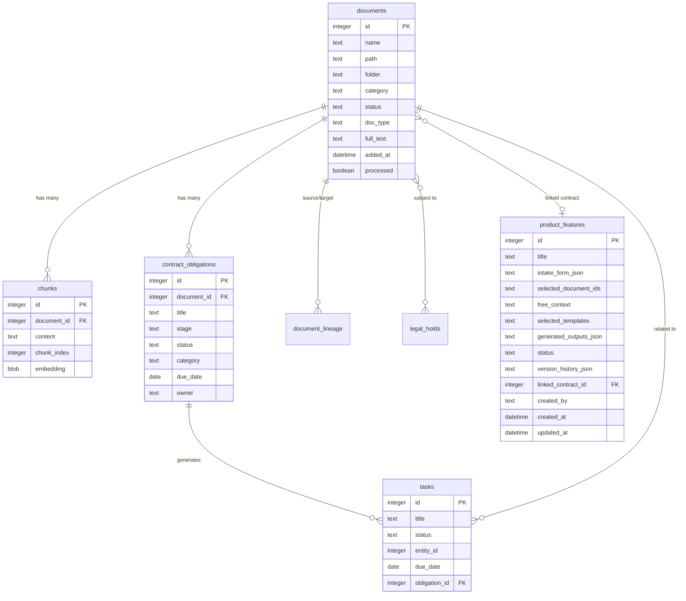

# Database Schema

This document describes the SQLite database structure used by ComplianceA.

## Entity Relationship Diagram

## Tables

### documents

Primary table for document library storage.

**Columns:**

| Column | Type | Description |
|--------|------|-------------|
| id | INTEGER PRIMARY KEY | Unique document identifier |
| name | TEXT | Display name |
| path | TEXT UNIQUE | File path on disk |
| folder | TEXT | Parent folder path |
| category | TEXT | Department category |
| status | TEXT | Document status (draft, in_review, approved, archived, disposed) |
| doc_type | TEXT | Document type (contract, policy, procedure, report, etc) |
| added_at | DATETIME | Upload timestamp |
| processed | BOOLEAN | Processing completion flag |
| page_count | INTEGER | Number of pages |
| word_count | INTEGER | Word count |
| content_hash | TEXT | SHA-256 of text content (duplicate detection) |
| file_hash | TEXT | SHA-256 of file binary (exact duplicate detection) |
| full_text | TEXT | Complete text (contracts only, non-chunked) |
| tags | TEXT | Comma-separated tags |
| auto_tags | TEXT | AI-generated tags |
| confirmed_tags | TEXT | User-confirmed tags |
| client | TEXT | Client name |
| jurisdiction | TEXT | Legal jurisdiction |
| sensitivity | TEXT | Data sensitivity level |
| language | TEXT | Document language |
| in_force | BOOLEAN | Currently in force flag |
| version | INTEGER | Version number |
| canonical_id | INTEGER | Reference to canonical version |
| superseded_by | INTEGER | Reference to newer version |
| retention_label | TEXT | Retention policy label |
| retention_until | DATE | Retention expiration date |
| legal_hold | BOOLEAN | Legal hold flag |
| gdrive_file_id | TEXT | Google Drive file ID |
| gdrive_modified_time | DATETIME | Last modified time in Drive |
| sync_status | TEXT | Sync status (synced, deleted, error) |
| storage_backend | TEXT DEFAULT 'local' | Storage backend: `local` or `s3` (added Plan 029) |
| storage_key | TEXT | S3 object key when storage_backend = 's3' (null for local files) |
| contracting_company | TEXT | Company party to contract |
| contracting_vendor | TEXT | Vendor party to contract |
| signature_date | DATE | Contract signature date |
| commencement_date | DATE | Contract start date |
| expiry_date | DATE | Contract end date |
| contract_type | TEXT | Contract type enum: vendor, b2b, employment, nda, lease, licensing, partnership, framework, other (added Plan 052) |
| is_historical | INTEGER DEFAULT 0 | Historical contract flag — set during processing when expiry_date < org's gdrive_historical_cutoff; historical contracts have no obligations generated (added Plan 053) |

**Indexes:**
- PRIMARY KEY (id)
- UNIQUE (path)
- INDEX (category)
- INDEX (status)
- INDEX (doc_type)
- INDEX (content_hash)
- INDEX (file_hash)

---

### chunks

Text chunks with embeddings for semantic search.

**Columns:**

| Column | Type | Description |
|--------|------|-------------|
| id | INTEGER PRIMARY KEY | Unique chunk identifier |
| document_id | INTEGER | Foreign key to documents.id |
| content | TEXT | Chunk text content |
| chunk_index | INTEGER | Position in document (0-based) |
| embedding | BLOB | Float32Array vector (1024 dimensions) |

**Indexes:**
- PRIMARY KEY (id)
- INDEX (document_id)

**Notes:**
- Contracts do NOT have chunks (full_text stored in documents table)
- Chunk size: ~500 words with 50-word overlap
- Embeddings generated via Voyage AI (voyage-3-lite)

---

### contract_obligations

Obligations extracted from contracts or created manually.

**Columns:**

| Column | Type | Description |
|--------|------|-------------|
| id | INTEGER PRIMARY KEY | Unique obligation identifier |
| document_id | INTEGER | Foreign key to documents.id |
| obligation_type | TEXT | Type of obligation |
| title | TEXT | Obligation title |
| description | TEXT | Full description |
| clause_reference | TEXT | Contract clause reference |
| stage | TEXT | Lifecycle stage (not_signed, signed, active, terminated) |
| status | TEXT | Status (active, inactive, met, waived, finalized) |
| category | TEXT | Category (payment, reporting, compliance, operational) |
| due_date | DATE | Deadline date |
| start_date | DATE | Start date for repeating obligations |
| is_repeating | INTEGER | 0/1 flag for repeating obligations |
| recurrence_interval | INTEGER | Days between spawned child obligations |
| parent_obligation_id | INTEGER | FK to parent obligation (self-ref, nullable) |
| notice_period_days | INTEGER | Notice period in days |
| owner | TEXT | Responsible person |
| escalation_to | TEXT | Escalation contact |
| department | TEXT | Responsible department |
| evidence_json | TEXT | Evidence documents (JSON array of {id, name}) |
| finalization_note | TEXT | Completion note (required for finalization unless document provided) |
| finalization_document_id | INTEGER | Proof document ID (required unless note provided) |
| details_json | TEXT | Legacy additional details (JSON) |

**Indexes:**
- PRIMARY KEY (id)
- INDEX (document_id)
- INDEX (status)
- INDEX (due_date)

**Notes:**
- Categories: payment, reporting, compliance, operational (4 canonical types)
- Repeating obligations: `spawnDueObligations()` runs on each GET, creates child when due_date is past and no child exists yet
- Completion (finalization) requires at least one of: finalization_note or finalization_document_id
- Stage transitions: not_signed → signed → active → terminated (drives obligation activation)

---

### tasks

Action items and deadlines.

**Columns:**

| Column | Type | Description |
|--------|------|-------------|
| id | INTEGER PRIMARY KEY | Unique task identifier |
| title | TEXT | Task title |
| description | TEXT | Task description |
| status | TEXT | Status (open, resolved, dismissed) |
| entity_type | TEXT | Related entity type (document, obligation) |
| entity_id | INTEGER | Related entity ID |
| task_type | TEXT | Task category |
| due_date | DATE | Deadline |
| owner | TEXT | Assigned person |
| escalation_to | TEXT | Escalation contact |
| obligation_id | INTEGER | Foreign key to contract_obligations.id |
| created_at | DATETIME | Creation timestamp |

**Indexes:**
- PRIMARY KEY (id)
- INDEX (status)
- INDEX (entity_type, entity_id)
- INDEX (obligation_id)
- INDEX (due_date)

---

### qa_cards

Reusable questionnaire answers.

**Columns:**

| Column | Type | Description |
|--------|------|-------------|
| id | INTEGER PRIMARY KEY | Unique Q&A card identifier |
| question_text | TEXT | Question text |
| approved_answer | TEXT | Approved answer text |
| evidence_json | TEXT | Evidence documents (JSON array) |
| status | TEXT | Status (active, archived) |
| question_embedding | BLOB | Question vector for semantic matching |
| created_at | DATETIME | Creation timestamp |
| updated_at | DATETIME | Last update timestamp |

**Indexes:**
- PRIMARY KEY (id)
- INDEX (status)

**Notes:**
- Used for questionnaire auto-fill
- Semantic matching via question_embedding

---

### audit_log

Complete action history for compliance.

**Columns:**

| Column | Type | Description |
|--------|------|-------------|
| id | INTEGER PRIMARY KEY | Unique log entry identifier |
| entity_type | TEXT | Entity type (document, obligation, task, etc) |
| entity_id | INTEGER | Entity ID |
| action | TEXT | Action performed |
| details | TEXT | Action details (JSON) |
| created_at | DATETIME | Timestamp |

**Indexes:**
- PRIMARY KEY (id)
- INDEX (entity_type, entity_id)
- INDEX (created_at)

**Notes:**
- Every significant action logged
- Immutable (no updates/deletes)

---

### document_lineage

Version and duplicate tracking.

**Columns:**

| Column | Type | Description |
|--------|------|-------------|
| id | INTEGER PRIMARY KEY | Unique lineage entry identifier |
| source_id | INTEGER | Source document ID |
| target_id | INTEGER | Target document ID |
| relationship | TEXT | Relationship type (duplicate_of, version_of) |
| confidence | REAL | Confidence score (0-1) |
| created_at | DATETIME | Detection timestamp |

**Indexes:**
- PRIMARY KEY (id)
- INDEX (source_id)
- INDEX (target_id)

**Notes:**
- Tracks exact duplicates (file_hash match)
- Tracks near-duplicates (embedding similarity > 0.92)
- Tracks versions (manual relationships)

---

### policy_rules

Document classification and retention policies.

**Columns:**

| Column | Type | Description |
|--------|------|-------------|
| id | INTEGER PRIMARY KEY | Unique policy identifier |
| name | TEXT | Policy name |
| condition_json | TEXT | Match conditions (JSON) |
| action_type | TEXT | Action to take (set_retention, require_approval, add_tag, flag_review) |
| action_params | TEXT | Action parameters (JSON) |
| enabled | BOOLEAN | Enabled flag |
| created_at | DATETIME | Creation timestamp |

**Indexes:**
- PRIMARY KEY (id)
- INDEX (enabled)

**Notes:**
- Evaluated after document processing
- Conditions match on doc_type, jurisdiction, tags, client, etc

---

### legal_holds

Legal hold management.

**Columns:**

| Column | Type | Description |
|--------|------|-------------|
| id | INTEGER PRIMARY KEY | Unique hold identifier |
| matter_name | TEXT | Matter/case name |
| scope_json | TEXT | Document scope criteria (JSON) |
| status | TEXT | Status (active, released) |
| created_at | DATETIME | Hold placement date |
| released_at | DATETIME | Release date |
| notes | TEXT | Additional notes |

**Indexes:**
- PRIMARY KEY (id)
- INDEX (status)

**Notes:**
- Documents under hold cannot be deleted/disposed
- Overrides retention policies

---

### app_settings

Key-value configuration storage.

**Columns:**

| Column | Type | Description |
|--------|------|-------------|
| key | TEXT PRIMARY KEY | Setting key |
| value | TEXT | Setting value (may be JSON) |
| updated_at | DATETIME | Last update timestamp |

**Indexes:**
- PRIMARY KEY (key)

**Notes:**
- Stores: API keys, legacy feature flags, global configuration
- GDrive credentials moved to `org_settings` per-org keys in Plan 053
- Sensitive values should be encrypted

---

### org_settings

Per-org key-value configuration storage. (Added Plan 027+)

**Columns:**

| Column | Type | Description |
|--------|------|-------------|
| org_id | INTEGER | Organization ID (FK → organizations.id) |
| key | TEXT | Setting key |
| value | TEXT | Setting value (may be JSON or encrypted) |
| updated_at | DATETIME DEFAULT CURRENT_TIMESTAMP | Last update timestamp |

**Indexes:**
- PRIMARY KEY (org_id, key)

**Known keys:**
- `s3Bucket`, `s3Region`, `s3AccessKeyId`, `s3SecretEncrypted`, `s3Endpoint` — per-org S3 storage (Plan 029)
- `gdrive_service_account` — service account JSON for Google Drive (Plan 053)
- `gdrive_drive_id` — Shared Drive ID or folder ID (Plan 053)
- `gdrive_historical_cutoff` — ISO date string; contracts with expiry before this date are marked historical (Plan 053)
- `gdrive_last_sync_time` — ISO timestamp of last successful GDrive sync; persisted to survive restarts (Plan 053)
- `gdrive_enabled` — `"1"` if GDrive integration is active for this org (Plan 053)

---

## Relationships

**documents -> chunks**
- One document has many chunks (unless it's a contract)
- CASCADE DELETE (delete chunks when document deleted)

**documents -> contract_obligations**
- One contract has many obligations
- CASCADE DELETE (delete obligations when contract deleted)
- **Important:** SQLite `ON DELETE CASCADE` requires `PRAGMA foreign_keys = ON` per-connection. This PRAGMA is not set in the application — obligation cleanup on document delete is handled via explicit `DELETE FROM contract_obligations WHERE document_id = ?` in the delete API route.
- **Archive / GDrive-delete rule:** When a contract is archived (`documents.status = 'archived'`) or marked as deleted by GDrive sync (`documents.sync_status = 'deleted'`), its obligations must be deleted explicitly. These are application-level status changes (not DB hard-deletes), so the FK cascade does not fire and the application must call `deleteObligationsByDocumentId()` directly.

**contract_obligations -> tasks**
- One obligation can generate multiple tasks
- Tasks reference obligation_id
- Tasks remain if obligation deleted (audit trail)

**documents -> tasks**
- Documents can have associated tasks (review, approval, etc)
- Tasks reference entity_type="document" + entity_id

**documents -> document_lineage**
- Many-to-many relationship tracking versions and duplicates
- source_id and target_id both reference documents.id

**documents <-> legal_holds**
- Many-to-many relationship (implicit via scope_json)
- Legal holds define scope criteria (doc_type, tags, date range)
- Documents flagged via legal_hold boolean

---

### product_features

Stores Product Hub features created by users -- each feature goes through a 4-step wizard (intake form -> document context -> template selection -> AI generation).

**Columns:**

| Column | Type | Description |
|--------|------|-------------|
| id | INTEGER PRIMARY KEY | Auto-incremented feature identifier |
| title | TEXT NOT NULL | Feature display name (default: 'Untitled Feature') |
| intake_form_json | TEXT | JSON-serialised `IntakeForm` object (sections A/B/C) |
| selected_document_ids | TEXT | JSON array of document IDs selected as context |
| free_context | TEXT | Free-form context pasted by the user (emails, notes, etc.) |
| selected_templates | TEXT | JSON array of `TemplateId` values (prd, tech_spec, feature_brief, business_case) |
| generated_outputs_json | TEXT | JSON map of `TemplateId -> { sections: Record<string,string>, gaps: string[] }` |
| status | TEXT | Feature lifecycle status: idea, in_spec, in_review, approved, in_development, shipped (default: 'idea') |
| version_history_json | TEXT | JSON array of `VersionSnapshot` objects (timestamp, trigger, templates, snapshot) -- capped at 20 entries |
| linked_contract_id | INTEGER | FK -> documents.id for contract traceability (nullable) |
| created_by | TEXT | Creator identifier (nullable) |
| created_at | DATETIME | Creation timestamp (auto) |
| updated_at | DATETIME | Last-modified timestamp (auto) |

**Indexes:**
- `idx_product_features_status` on `status`
- `idx_product_features_created` on `created_at`

**Relationships:**
- `linked_contract_id` references `documents.id` (optional contract traceability link)
- `selected_document_ids` references `documents.id` values (stored as JSON, not a FK)

---

### contract_invoices

Invoice records attached to contracts. Stores financial data, payment status, and references to uploaded invoice and payment confirmation files. Files are stored in `DOCUMENTS_DIR/invoices/` (separate from the main document library).

**Columns:**

| Column | Type | Description |
|--------|------|-------------|
| id | INTEGER PRIMARY KEY | Auto-incremented invoice identifier |
| contract_id | INTEGER NOT NULL | FK → documents.id (contract document) |
| amount | REAL NOT NULL | Invoice amount (numeric for aggregation) |
| currency | TEXT NOT NULL | Currency code (EUR, USD, PLN, GBP, etc.) |
| description | TEXT | Optional description / invoice reference |
| date_of_issue | DATE | Date invoice was issued |
| date_of_payment | DATE | Due date for payment |
| is_paid | INTEGER DEFAULT 0 | 0 = unpaid, 1 = paid |
| invoice_file_path | TEXT | Path to uploaded invoice PDF on disk |
| payment_confirmation_path | TEXT | Path to uploaded payment confirmation file on disk |
| document_id | INTEGER | FK → documents.id (nullable — set when invoice was auto-imported from Google Drive; links to the documents library entry) |
| created_at | DATETIME DEFAULT CURRENT_TIMESTAMP | Record creation timestamp |
| updated_at | DATETIME DEFAULT CURRENT_TIMESTAMP | Last update timestamp |

**Indexes:**
- `idx_invoices_contract` on `contract_id`
- `idx_invoices_payment_date` on `date_of_payment`

**Relationships:**
- `contract_id` references `documents.id` (ON DELETE CASCADE)
- `document_id` references `documents.id` (ON DELETE SET NULL — nullable; only set for GDrive-sourced invoices)

**Overdue rule:** An invoice is overdue when `date_of_payment < today AND is_paid = 0`.

**Totals:** `SUM(amount)` = total invoiced; `SUM(amount WHERE is_paid = 1)` = total paid.

---

### contract_documents

Junction table linking additional documents (amendments, addenda, exhibits) to contracts. Supports two modes: linking an existing document from the library (`document_id` set) or attaching a freshly uploaded file (`file_path` set, `document_id` null). Files uploaded as contract attachments are stored in `DOCUMENTS_DIR/contract-attachments/` and do NOT appear in the main Documents library.

**Columns:**

| Column | Type | Description |
|--------|------|-------------|
| id | INTEGER PRIMARY KEY | Auto-incremented attachment identifier |
| contract_id | INTEGER NOT NULL | FK → documents.id (contract document) |
| document_id | INTEGER | FK → documents.id (nullable — set when linking an existing library document) |
| file_path | TEXT | Path to uploaded attachment file on disk (nullable — set when uploading a new file) |
| file_name | TEXT | Original filename for display |
| document_type | TEXT | Classification: amendment, addendum, exhibit, annex, other |
| label | TEXT | Optional human-readable label |
| added_at | DATETIME DEFAULT CURRENT_TIMESTAMP | Attachment timestamp |

**Indexes:**
- `idx_contract_docs_contract` on `contract_id`

**Relationships:**
- `contract_id` references `documents.id` (ON DELETE CASCADE)
- `document_id` references `documents.id` (ON DELETE SET NULL — if a library document is deleted, the attachment record persists without its link)

**Invariant:** Exactly one of `document_id` or `file_path` must be non-null per row.

---

## Data Types

**TEXT** - Variable-length strings (UTF-8)
**INTEGER** - Signed integers (up to 8 bytes)
**REAL** - Floating point numbers
**BLOB** - Binary data (embeddings stored as Float32Array buffers)
**BOOLEAN** - Stored as INTEGER (0 = false, 1 = true)
**DATE** - Stored as TEXT (ISO 8601 format: YYYY-MM-DD)
**DATETIME** - Stored as TEXT (ISO 8601 format: YYYY-MM-DD HH:MM:SS)

---

---

## Multi-Tenancy Tables (Plan 027+)

These tables were introduced in Plan 027 to support the multi-tenant organization model. All data tables carry an `org_id` FK referencing `organizations`.

### organizations

Firm/workspace identity. One row per tenant.

| Column | Type | Description |
|--------|------|-------------|
| id | INTEGER PRIMARY KEY AUTOINCREMENT | Unique org identifier |
| name | TEXT NOT NULL | Display name (e.g. "Acme Legal") |
| slug | TEXT UNIQUE NOT NULL | URL-safe identifier (e.g. "acme-legal") |
| created_at | DATETIME DEFAULT CURRENT_TIMESTAMP | Creation timestamp |
| deleted_at | DATETIME | Soft-delete timestamp (null = active; set = pending deletion, hard-deleted after 30 days) — added Plan 030 |
| storage_policy | TEXT NOT NULL DEFAULT 'platform_s3' | Storage backend for this org: `local` (Railway disk), `platform_s3` (shared platform bucket), `own_s3` (org-configured bucket) — added Plan 034; default changed to `platform_s3` in Plan 035 |

### org_features

Per-org feature enablement flags. Super admin toggles which product features each organization can access. Absence of a row = feature enabled by default (opt-out model). (Added Plan 034)

| Column | Type | Description |
|--------|------|-------------|
| org_id | INTEGER NOT NULL FK → organizations(id) | Owning org |
| feature | TEXT NOT NULL | Feature key: `contracts`, `legal_hub`, `template_editor`, `court_fee_calculator`, `policies`, `qa_cards` |
| enabled | INTEGER NOT NULL DEFAULT 1 | 1 = feature enabled, 0 = disabled |
| updated_at | DATETIME DEFAULT CURRENT_TIMESTAMP | Last change timestamp |

Primary key: `(org_id, feature)`. Super admins bypass all feature checks and always have access to every feature regardless of this table.

### platform_settings

Global platform-level configuration managed by super admins. Not scoped to any specific org. (Added Plan 034)

| Column | Type | Description |
|--------|------|-------------|
| key | TEXT PRIMARY KEY | Setting key (e.g. `s3Bucket`, `s3Region`, `s3AccessKeyId`, `s3SecretEncrypted`, `s3Endpoint`) |
| value | TEXT | Setting value (credentials stored AES-256-GCM encrypted) |
| updated_at | DATETIME DEFAULT CURRENT_TIMESTAMP | Last change timestamp |

### migration_jobs

Tracks async file migration jobs. One row per migration run. Supports global (org_id = NULL) and per-org jobs. (Added Plan 034; extended Plan 035)

| Column | Type | Description |
|--------|------|-------------|
| id | INTEGER PRIMARY KEY AUTOINCREMENT | Job identifier |
| org_id | INTEGER | Target org (NULL = global migration across all orgs) — added Plan 035 |
| migration_type | TEXT DEFAULT 'local_to_platform_s3' | `local_to_platform_s3` (local fs → platform S3) or `own_s3_to_platform_s3` (org S3 → platform S3) — added Plan 035 |
| status | TEXT NOT NULL DEFAULT 'pending' | `pending`, `running`, `completed`, `failed` |
| total_files | INTEGER NOT NULL DEFAULT 0 | Total files to migrate |
| migrated_files | INTEGER NOT NULL DEFAULT 0 | Successfully migrated so far |
| failed_files | INTEGER NOT NULL DEFAULT 0 | Files that failed to migrate |
| skipped_files | INTEGER NOT NULL DEFAULT 0 | Files skipped (e.g. no S3 configured for org) |
| error | TEXT | Last error message (nullable) |
| started_at | DATETIME | When job began running |
| completed_at | DATETIME | When job finished (success or failure) |
| created_at | DATETIME DEFAULT CURRENT_TIMESTAMP | Row creation timestamp |

### wizard_blueprints

Stores custom reusable template wizard blueprints per organization. Predefined system blueprints are hardcoded in `src/lib/wizard-blueprints.ts` and not stored in this table. (Added Plan 036)

| Column | Type | Description |
|--------|------|-------------|
| id | INTEGER PRIMARY KEY AUTOINCREMENT | Blueprint identifier |
| org_id | INTEGER NOT NULL FK → organizations(id) | Owning org |
| name | TEXT NOT NULL | Blueprint display name (e.g. "My Pozew Structure") |
| sections_json | TEXT NOT NULL DEFAULT '[]' | JSON array of `{title: string, sectionKey: string\|null, variableHintKeys: string[]}` — ordered list of sections |
| created_at | DATETIME DEFAULT CURRENT_TIMESTAMP | Creation timestamp |

`sectionKey` is `null` for user-created sections (all variables shown) or one of the predefined keys (`court_header`, `parties`, `claim`, `factual_basis`, `evidence`, `closing`, etc.) for variable hint scoping.

### org_members

Maps users to orgs with a per-org role. A user may belong to multiple orgs.

| Column | Type | Description |
|--------|------|-------------|
| id | INTEGER PRIMARY KEY AUTOINCREMENT | Row identifier |
| org_id | INTEGER NOT NULL FK → organizations(id) | Owning org |
| user_id | INTEGER NOT NULL FK → users(id) | Member user |
| role | TEXT NOT NULL DEFAULT 'member' | Role: `owner`, `admin`, `member` |
| joined_at | DATETIME DEFAULT CURRENT_TIMESTAMP | Enrolment timestamp |
| invited_by | INTEGER FK → users(id) | User who sent the invite (nullable) |

Constraint: `UNIQUE(org_id, user_id)` — one membership record per user per org.

### org_invites

Tokenized invite records. Table created by Plan 027; invite flow implemented by Plan 028.

| Column | Type | Description |
|--------|------|-------------|
| token | TEXT PRIMARY KEY | Cryptographically random UUID invite token |
| org_id | INTEGER NOT NULL FK → organizations(id) | Inviting org |
| email | TEXT NOT NULL | Invited email address |
| role | TEXT NOT NULL DEFAULT 'member' | Role to assign on acceptance |
| expires_at | DATETIME NOT NULL | Token expiry (7 days from creation) |
| accepted_at | DATETIME | Set when invite is consumed (null = pending) |

---

### member_permissions

Per-user feature-level permission overrides. Populated from `org_permission_defaults` when a user joins an org. (Added Plan 031)

| Column | Type | Description |
|--------|------|-------------|
| org_id | INTEGER NOT NULL FK → organizations(id) | Owning org |
| user_id | INTEGER NOT NULL FK → users(id) | Member user |
| resource | TEXT NOT NULL | Feature area: `documents`, `contracts`, `legal_hub`, `policies`, `qa_cards` |
| action | TEXT NOT NULL DEFAULT 'full' | Permission level: `none`, `view`, `edit`, `full` |

Primary key: `(org_id, user_id, resource)`

### org_permission_defaults

Org-level default permissions applied to new members. Seeded with `full` for all resources when an org is created. (Added Plan 031)

| Column | Type | Description |
|--------|------|-------------|
| org_id | INTEGER NOT NULL FK → organizations(id) | Owning org |
| resource | TEXT NOT NULL | Feature area (same enum as member_permissions) |
| action | TEXT NOT NULL DEFAULT 'full' | Default permission level for new members |

Primary key: `(org_id, resource)`

---

### token_usage

Per-invocation AI token consumption log. One row per AI endpoint call per user. Used by the super-admin token usage dashboard. (Added Plan 048)

| Column | Type | Description |
|--------|------|-------------|
| id | INTEGER PRIMARY KEY AUTOINCREMENT | Row identifier |
| user_id | INTEGER NOT NULL FK → users(id) | User who triggered the AI call |
| org_id | INTEGER NOT NULL FK → organizations(id) | Org context at time of call |
| route | TEXT NOT NULL | API route that generated the usage (e.g. `/api/ask`, `/api/analyze`, `/api/legal-hub/cases/chat`) |
| model | TEXT NOT NULL | Primary model used: `sonnet`, `haiku` |
| input_tokens | INTEGER NOT NULL DEFAULT 0 | Claude input tokens consumed |
| output_tokens | INTEGER NOT NULL DEFAULT 0 | Claude output tokens consumed |
| voyage_tokens | INTEGER NOT NULL DEFAULT 0 | Voyage AI embedding tokens consumed (0 if no embeddings used) |
| cost_usd | REAL NOT NULL DEFAULT 0 | Estimated cost in USD computed from PRICING constants |
| created_at | DATETIME DEFAULT CURRENT_TIMESTAMP | Timestamp of the AI call |

**Indexes:**
- PRIMARY KEY (id)
- INDEX (user_id)
- INDEX (org_id)
- INDEX (created_at)

**Notes:**
- Writes are fire-and-forget — a failed insert must not affect the AI response
- `cost_usd` = `(input_tokens / 1_000_000 * model_input_rate) + (output_tokens / 1_000_000 * model_output_rate) + (voyage_tokens / 1_000 * voyage_rate)`
- Rates from `src/lib/constants.ts` PRICING: Sonnet $3.00/$15.00 per 1M, Haiku $0.25/$1.25 per 1M, Voyage $0.02 per 1K

---

## Storage Size Estimates

**documents**: ~2-5 KB per record (varies with full_text)
**chunks**: ~1.5 KB per chunk (500 words + 4 KB embedding)
**contract_obligations**: ~1 KB per obligation
**tasks**: ~500 bytes per task
**qa_cards**: ~2 KB per card
**audit_log**: ~500 bytes per entry
**product_features**: ~5-50 KB per record (varies with generated_outputs_json and version_history_json)

**Typical database size**: 50-100 MB for 1000 documents with embeddings
